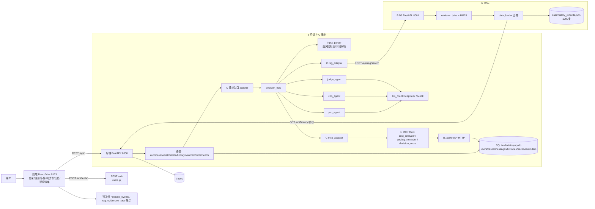
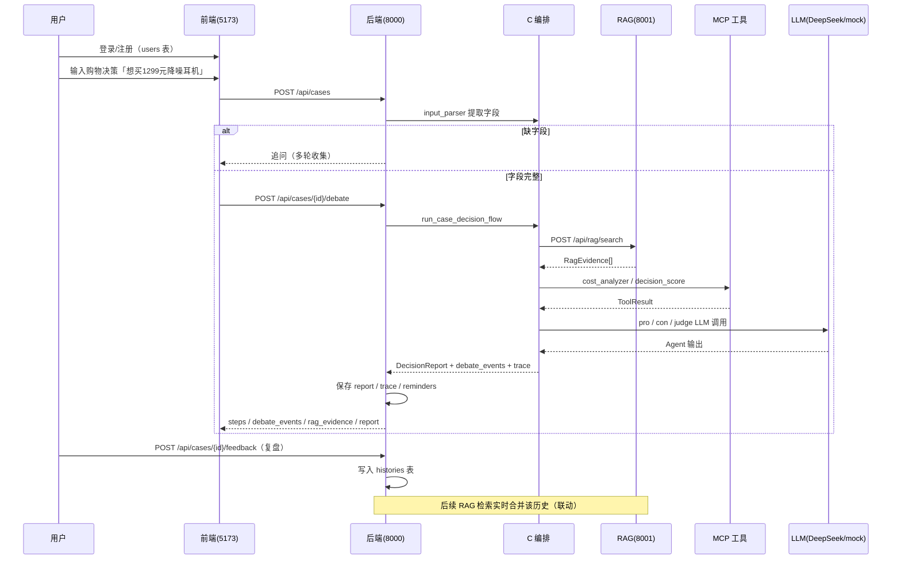

# DecisionJury 系统架构图描述（供 AI 生成架构图）

> 用法：把本文件内容整体复制给其他 AI（或直接渲染其中的 Mermaid 代码块），即可生成架构图。
> 内容已按当前 `dev` 分支真实代码核对，可放心作为生成依据。

## 0. 一句话定位

DecisionJury 是一个「多 Agent 冷静决策助手」Web 系统：用户提交购物/时间决策，系统通过
**多轮补全 → RAG 检索历史 → MCP 工具计算 → 正反方辩论 → 法官裁决**，输出可解释的「决策判决书」，
并支持用户注册登录、案件/历史/观察清单管理与复盘反馈。

项目按角色分 5 个模块：

- **A 前端**：页面与交互（含登录注册、创建案件、多轮对话、庭审事件、判决书、历史、观察清单）。
- **B 后端 API 与状态**：FastAPI 接口、SQLite 状态管理、用户认证基础。
- **C Agent 编排与 LLM**：输入解析、正/反方、法官 Agent 与 DeepSeek 调用。
- **D RAG 与数据检索**：历史数据、BM25 检索、证据引用、实时联动、量化评估。
- **E MCP 工具与工程化**：cost_analyzer、cooling_reminder、decision_score、调用日志、部署脚本。

## 1. 技术栈与端口

| 层 | 技术 | 端口/地址 |
|---|---|---|
| 前端 | React + Vite（TypeScript），含主题/登录认证 | `http://localhost:5173` |
| 后端 | FastAPI + SQLAlchemy + SQLite + uvicorn + passlib（密码哈希） | `http://127.0.0.1:8000`（Swagger `/docs`） |
| RAG 服务 | FastAPI + jieba + rank_bm25（BM25，无向量库） | `http://127.0.0.1:8001` |
| LLM | DeepSeek（`deepseek-v4-pro`），未配 Key 时 fallback MockLLM | 外部 API |
| 数据 | SQLite `data/decisionjury.db`；RAG 静态知识库 `data/history_records.json`（1000 条） | 本地 |
| 部署 | `deploy/install.sh`、`deploy/start.sh`、`deploy/stop.sh`（Linux），`start_all.bat`/`stop_all.bat`（Windows） | 可选 |

## 2. 组件清单（按职责分）

### 2.1 前端（A）—— React + Vite
- 页面：`HomePage`、`CreateCasePage`、`ChatPage`（多轮/辩论）、`VerdictPage`（判决书）、
  `HistoryPage`、`WatchlistPage`、`LoginPage`、`RegisterPage`。
- 基础设施：`api/index.ts`（REST 客户端）、`api/auth.ts`（登录注册）、`auth/AuthContext` + `AuthShell` + `RequireAuth`（认证壳）、
  `theme/ThemeContext`（主题）、`utils/format`、`utils/errors`。
- 只调用后端 REST API（用户登录后取 `user_id`），不直接调 LLM/RAG/MCP。

### 2.2 后端（B）—— FastAPI 主服务
- 路由层：`/api/auth/register`、`/api/auth/login`、`/api/cases`（创建/查询/列表/PATCH/**DELETE**）、
  `/api/cases/{id}/messages`、`/api/cases/{id}/debate`、`/api/cases/{id}/report`、`/api/cases/{id}/trace`、
  `/api/cases/{id}/feedback`、`/api/history`、`/api/watchlist`、
  `/api/tools/cost-analyzer`、`/api/tools/cooling-reminder`、`/api/tools/decision-score`、`/api/health`。
- 持久化：SQLite，表 `users / cases / messages / histories / traces / reminders`；
  启动时自动检测/重建/迁移（`backend/migrate.py`）。
- 删除：`DELETE /api/cases/{case_id}` 对 histories 做**软删除**（`is_deleted=1`，RAG 仍可检索历史）。
- 调用 C：`backend/app/orchestrator/adapter.py` 提供 `run_case_decision_flow` 入口。

### 2.3 C —— Agent 编排（位于后端内）
- Agent：`input_parser`（风险标记 + 字段解析，DeepSeek 解析失败回退本地规则）、
  `pro_agent`（正方）、`con_agent`（反方）、`judge_agent`（法官）。
- 编排：`backend/app/orchestrator/decision_flow.py`（购物主流程；产出 **debate_events 庭审事件**）。
- 服务：`llm_client.py`（DeepSeek + mock fallback）、`rag_adapter.py`（HTTP 调 RAG）、
  `mcp_adapter.py`（本地调 E 工具：cost_analyzer / cooling_reminder / **decision_score**）、`mock_rag.py`。
- 结构化对象：`RagEvidence / ToolResult / DecisionReport / AgentStep / DebateEvent / TraceItem / DebateResult`。
- 说明：高风险输入会**标记化**（`is_high_risk`/`reject_reason`），辩论路由保留 `HIGH_RISK_DECISION` 拦截分支；
  主流程目前仅支持 `shopping`，`time` 待实现。

### 2.4 D —— RAG 服务（独立 FastAPI，8001）
- `retriever.py`：`POST /api/rag/search`，jieba 分词 + BM25Okapi，case_type 类型隔离，
  结果按 title 去重，只返回 `RagEvidence` 契约字段。
- `data_loader.py`：合并「静态 1000 条 JSON」+「B 后端 `/api/history` 实时历史」：
  按 user_id 拉取、字段映射（`summary→content`、`history_id→id`）、按 id 去重、后端不可用回退静态。
- 工具脚本：`build_history_data.py`（生成数据）、`evaluate_rag.py`（检索评测）、
  `evaluate_rag_standard.py`（P/R/MRR/NDCG + 忠实度/答案相关性）、`evaluate_dialogue_quality.py`、
  `e2e_verify.py`（端到端联调）。

### 2.5 E —— MCP 工具（`mcp_tools/`）
- `cost_analyzer.py`（购物/时间成本分析）、`cooling_reminder.py`（冷静期提醒）、
  **`decision_score.py`**（0~100 综合决策评分）、`logger.py`（调用日志）、`mcp.py`（MCP 契约层）、`demo.py`。
- 两条接入路径：
  - **C 主流程**：C 的 `mcp_adapter` 直接调用 E 本地函数（cost_analyzer / cooling_reminder / decision_score）。
  - **HTTP 端点**：B 提供 `/api/tools/cost-analyzer`、`/api/tools/cooling-reminder`、`/api/tools/decision-score`；
    cooling_reminder 会写 SQLite `reminders` 表。

## 3. 核心调用关系

```text
用户(浏览器)
  ├─> 前端(5173)：登录/注册后进入应用
  │    ├─> 后端 /api/auth/*  (users 表)
  │    └─> 后端 /api/* REST
  │         ├─> SQLite(decisionjury.db: users/cases/messages/histories/traces/reminders)
  │         └─> C 编排入口(adapter → decision_flow)
  │              ├─> input_parser（风险标记 + 字段解析）
  │              ├─> RAG(8001)  POST /api/rag/search
  │              │      ├─> BM25 检索 data/history_records.json(1000 条)
  │              │      └─> 联动: GET 后端 /api/history 合并实时历史
  │              ├─> MCP 工具(E 模块 cost_analyzer / cooling_reminder / decision_score)
  │              ├─> pro_agent ─> LLM(DeepSeek/mock)
  │              ├─> con_agent ─> LLM
  │              └─> judge_agent ─> LLM ─> DecisionReport + debate_events
  │                   └─> 后端保存 report/trace/reminders → 前端展示
  └─> 反馈复盘 ─ 后端 /feedback ─ 写 histories 表 ─ RAG 下次检索自动纳入
```

## 4. 典型流程（购物决策，主链路已实现）

1. 用户注册/登录（`users` 表），进入前端。
2. 创建购物案件「想买 1299 元降噪耳机…」→ `input_parser` 提取字段（DeepSeek 优先，失败回退本地规则）；不足则多轮追问，完整后 `ready_for_debate`。
3. `POST /api/cases/{id}/debate` → C 编排：
   - RAG 检索 `POST /api/rag/search`（8001）→ `RagEvidence[]`；
   - `cost_analyzer` 成本分析 → `decision_score` 综合评分；
   - 正/反方辩论（LLM）；
   - 按风险等级/触发原因调用 `cooling_reminder`；
   - 法官生成 `DecisionReport`，并产出 `debate_events`（clerk/pro/con/judge 庭审事件）。
4. 后端保存：案件 `completed`、`final_decision`、`report_id`、`trace`、`reminders`。
5. 返回 `steps / debate_events / rag_evidence / tool_results / report` 给前端展示。
6. 用户提交复盘 → 写 `histories` 表 → 后续 RAG 检索**实时合并**这条新历史（联动闭环）。

## 5. 数据存储

- SQLite（B）：`users`、`cases`、`messages`、`histories`（含 `is_deleted` 软删除）、`traces`、`reminders`。
- RAG 知识库：`data/history_records.json`（购物 500 + 时间 500，共 1000 条，含清洁/纸品/厨房/个护/家纺/文具等日用品品类）+ B 实时历史（联动）。
- 未使用向量库（当前为 BM25 内存索引）。

## 6. 建议出图形式（供 AI 选择）

1. **分层架构图**：前端层 → API/B 层 → C 编排/Agent 层 → RAG/MCP 服务层 → 数据层 → 外部 LLM。
2. **主流程时序图**：用户 → 前端（登录）→ 后端 → 编排 → RAG/MCP/LLM → 判决书 → 前端。
3. **模块依赖图**：A/B/C/D/E 模块 + 端口 + 关键接口（含 auth、删除、decision_score、debate_events）。

## 7. 可渲染的 Mermaid 草稿

### 7.1 分层架构图



### 7.2 主流程时序图



## 8. 出图时请标注的「现状说明」

- 购物主链路已跑通；**time 时间决策流程 C 尚未实现**（建议虚线/灰色标注）。
- 已支持：用户注册登录（users/passlib）、`DELETE` 案件 + histories 软删除、
  `decision_score` 工具、`debate_events` 庭审事件字段、前端改版（主题/认证壳/历史页）。
- RAG 为 BM25 检索（无向量库），并**实时联动 B 的 `/api/history`**。
- LLM 未配 Key 时走 mock；工具调用失败不中断主流程（fallback）。
- 高风险输入会标记化，辩论路由保留 `HIGH_RISK_DECISION` 拦截分支。
- 量化评估脚本（`evaluate_rag*.py`）属于 D 的附加能力，可单独画为「评估子系统」。
- 部署：Windows `start_all.bat` / `stop_all.bat`，Linux `deploy/*.sh`。
