<!-- 本文件由 docs/report/merge_report.py 自动生成，请勿直接编辑；修改请编辑 sections/ 下的对应文件。 -->

# DecisionJury 小学期实验报告

> 项目名称：DecisionJury——基于多 Agent 协作的日常冷静决策助手
> 课程名称：综合能力实训
> 本文档为章节合并版，最终排版请使用学校 Word 模板 `小学期实验报告模板(1).docx`。

---

# 目录

> 以下为分级目录；Word 版会通过目录域自动生成带页码的目录。

- 00 封面、摘要与引言
  - 摘要
  - 关键词
  - 0 引 言
    - 0.1 选题背景
    - 0.2 研究目的与意义
    - 0.3 项目范围与边界
    - 0.4 已有工作基础
    - 0.5 报告组织结构
- 01 项目概述
  - 1.1 项目背景
  - 1.2 项目简介
  - 1.3 项目计划
  - 1.4 团队分工
  - 1.5 项目范围与边界
    - 1.5.1 本轮交付范围
    - 1.5.2 不纳入本轮范围
    - 1.5.3 输出边界
  - 1.6 技术选型
- 02 需求分析
  - 2.1 用户角色与使用场景
    - 2.1.1 用户角色
    - 2.1.2 典型使用场景
  - 2.2 功能需求
    - 2.2.1 基本功能需求
    - 2.2.2 拓展功能需求
    - 2.2.3 信息收集字段
    - 2.2.4 业务流程
    - 2.2.5 输入边界与拒绝策略
  - 2.3 非功能需求
    - 2.3.1 性能需求
    - 2.3.2 可解释性需求
    - 2.3.3 可靠性与异常处理需求
    - 2.3.4 安全性需求
    - 2.3.5 可维护性与可扩展性需求
    - 2.3.6 可演示性需求
  - 2.4 需求优先级
  - 2.5 验收标准
- 03 设计方案
  - 3.1 数据描述
    - 3.1.1 数据存储总体设计
    - 3.1.2 核心数据结构
    - 3.1.3 案件状态设计
  - 3.2 功能设计
    - 3.2.1 系统总体架构
    - 3.2.2 模块职责设计
    - 3.2.3 接口设计
    - 3.2.4 前端页面设计
  - 3.3 关键算法说明
    - 3.3.1 输入解析与字段合并算法
    - 3.3.2 多 Agent 编排算法
    - 3.3.3 RAG 检索算法
    - 3.3.4 成本分析算法
    - 3.3.5 决策评分算法
    - 3.3.6 法官裁决算法
    - 3.3.7 冷静期提醒算法
  - 3.4 原型图设计
    - 3.4.1 登录与注册页面
    - 3.4.2 案件创建页面
    - 3.4.3 多轮对话页面
    - 3.4.4 庭审回放与判决书页面
    - 3.4.5 历史记录与观察清单页面
- 04 项目实现
  - 4.1 总体实现
    - 4.1.1 系统总体架构
    - 4.1.2 项目目录结构
    - 4.1.3 后端实现
    - 4.1.4 前端实现
    - 4.1.5 RAG 服务实现
    - 4.1.6 工具模块实现
    - 4.1.7 数据库实现
    - 4.1.8 部署与启动实现
  - 4.2 关键技术实现
    - 4.2.1 输入解析与多轮字段合并
    - 4.2.2 多 Agent 顺序编排
    - 4.2.3 RAG 检索实现
    - 4.2.4 成本分析与决策评分实现
    - 4.2.5 法官规则与模型说明
    - 4.2.6 JWT 登录与双模式鉴权
    - 4.2.7 前端关键实现
    - 4.2.8 异常处理与降级策略
- 05 项目测试
  - 5.1 测试环境与部署
    - 5.1.1 测试环境
    - 5.1.2 测试命令
    - 5.1.3 部署与启动
  - 5.2 测试策略与测试用例
  - 5.3 测试执行结果
    - 5.3.1 全量测试结果
    - 5.3.2 定向测试结果
    - 5.3.3 失败项与原因分析
    - 5.3.4 测试结果统计图
  - 5.4 RAG 检索评测
    - 5.4.1 检索命中评测
    - 5.4.2 检索指标评测
    - 5.4.3 RAG 服务与异常场景
  - 5.5 缺陷与修复
  - 5.6 项目展示
    - 5.6.1 购物决策完整流程
    - 5.6.2 多轮价格纠正流程
    - 5.6.3 工具调用与 RAG 输出
  - 5.7 测试结论
- 06 项目总结
  - 6.1 项目总结与体会
    - 6.1.1 项目完成情况
    - 6.1.2 技术收获
    - 6.1.3 团队协作体会
  - 6.2 不足与改进
  - 6.3 后续计划
- 07 参考文献与附录
  - 7.1 参考文献
  - 7.2 附录 A：接口一览
  - 7.3 附录 B：启动与测试命令
  - 7.4 附录 C：演示案例
  - 7.5 附录 D：团队成员分工
  - 7.6 附录 E：测试结果摘要

---

# 00 封面、摘要与引言

> 负责人：组长（全员确认）
> 状态：已完成
> 说明：封面中的班级、专业、学号、姓名需由组长按实际成员信息填写。

---

## 0.1 封面信息

| 字段 | 内容 |
|---|---|
| 课程名称 | 综合能力实训 |
| 项目名称 | DecisionJury——基于多 Agent 协作的日常冷静决策助手 |
| 班级 | 【请填写：班级】 |
| 专业 | 【请填写：专业】 |
| 任课教师 | 魏振文、赵双华 |
| 学号 | 【请填写：全组学号】 |
| 姓名 | 【请填写：全组成员姓名】 |
| 实践报告成绩 | （由指导教师填写） |

## 摘要

针对大学生日常购物中容易冲动消费、历史经验难以复用、预算与替代品信息分散等问题，对基于多 Agent 协作的购物冷静决策助手 DecisionJury 进行了设计与实现。系统采用 React 与 FastAPI 构建 Web 应用，使用 SQLite 保存案件、消息、历史记录和提醒数据；通过输入解析 Agent 提取商品名称、价格和剩余预算等关键字段，结合 jieba 分词与 BM25 算法实现历史记录检索，调用成本分析、决策评分和冷静期提醒工具，再由正方、反方和法官 Agent 依次生成独立陈述与辅助建议，最终输出包含证据、工具结果和后续动作的决策报告。系统还提供执行轨迹、观察清单和决策复盘功能，使用户复盘记录能够进入后续检索候选。测试结果表明，核心模块定向测试和 RAG 检索评测均通过，购物决策主流程可以完整运行，能够满足课程对多 Agent 协作、RAG 检索、MCP 工具和 Web 演示的基本要求。

## 关键词

多 Agent 协作；大语言模型；检索增强生成；BM25；MCP 工具；购物决策；冷静期提醒

---

## 0 引 言

### 0.1 选题背景

随着移动支付和电商平台的普及，大学生日常消费决策的频率明显提高。面对促销活动、种草内容和社交平台推荐，用户容易在信息不完整的情况下快速下单，事后才发现商品使用频率低、预算被挤占，或者已有替代品能够满足需求。与此同时，用户过去的购买记录、闲置经历和复盘结论往往分散在不同平台，难以在下次决策时被重新利用。普通问答式人工智能通常只给出单一结论，缺少正反两方面理由、个人历史证据和可解释的计算依据，难以帮助用户形成稳定的决策习惯。

在时间安排方面，学生同样面临类似问题：社团活动、课程任务和竞赛项目经常叠加出现，用户容易低估任务占用的时间，忽略已有截止日期，从而造成延期和精力透支。因此，构建一个能够整理信息、检索历史、计算成本并展示正反理由的辅助决策系统，具有一定的现实意义。

### 0.2 研究目的与意义

本项目的目标是完成一个可运行、可演示、可解释的购物冷静决策 Web 应用。用户以自然语言描述购买想法后，系统通过多轮对话补全商品名称、价格和本月剩余预算等关键字段，结合历史记录检索、规则工具计算和多 Agent 分析，输出一份包含正反观点、证据、工具结果和后续建议的决策报告。系统不替用户做决定，也不保证消费结果，而是通过结构化流程帮助用户看清需求、预算和风险。

项目意义主要体现在两个方面。一方面，系统把“买不买”这一日常问题拆解为“信息补全—历史检索—成本计算—正反分析—辅助建议—冷静期复盘”的完整链路，使决策过程更透明；另一方面，项目综合运用大语言模型、检索增强生成、规则工具和前后端工程化技术，能够验证多 Agent 协作在低风险日常决策场景中的可行性。

### 0.3 项目范围与边界

本项目只处理购物决策，重点支持“是否购买某件商品”这一场景。系统不处理医疗、法律、投资理财、借贷、就业离职、亲密关系等高风险决策；当输入包含明显高风险主题时，后端保留拒绝路径，并提示用户本项目仅支持低风险购物场景。时间决策主流程本轮不纳入交付范围，现有时间工具、枚举和样例数据仅作为组件兼容保留，不作为本轮完成度依据。

系统输出为辅助建议，使用“建议”“可以考虑”等措辞，不出现“必须”“一定”等强制性结论。系统不接入真实支付、真实下单、电商账号登录和全网比价，演示数据均为模拟数据。

### 0.4 已有工作基础

项目采用 Python + FastAPI + SQLAlchemy + SQLite 作为后端技术栈，前端采用 React 18 + TypeScript + Vite。输入解析 Agent 优先调用 DeepSeek 大语言模型完成结构化字段抽取，在未配置密钥或模型返回异常时回退到本地规则；正方 Agent、反方 Agent 和法官 Agent 使用统一的大模型调用协议，法官的最终结论由本地规则确定，大模型只负责生成自然语言说明，避免模型覆盖规则结果。

检索增强生成模块使用 jieba 分词和 BM25 算法，对 500 条模拟历史记录进行检索，并通过 HTTP 接口与后端实时历史记录合并。工具模块提供成本分析、决策评分和冷静期提醒三个规则工具，通过统一调用入口 `call_tool` 分发，并记录调用日志。后端提供注册登录、案件管理、多轮消息、辩论、报告、执行轨迹、历史记录、观察清单和复盘等接口，前端提供对应的页面和庭审回放展示。

### 0.5 报告组织结构

本报告共分为六章。第一章介绍项目背景、项目简介、项目计划和团队分工；第二章从功能需求和非功能需求两个方面分析系统需求；第三章介绍数据设计、功能设计、关键算法和原型设计；第四章说明系统总体实现和关键技术实现；第五章介绍测试环境、测试结果、缺陷修复和项目展示；第六章总结项目经验并分析不足与改进方向。最后给出参考文献和附录。

---

# 01 项目概述

> 负责人：C（组长），B 配合
> 状态：已完成

---

## 1.1 项目背景

大学生是日常购物决策的高频群体。面对电商平台的促销活动、短视频种草和社交平台推荐，用户容易在信息不完整、情绪被放大的情况下快速下单；购买之后才发现商品使用频率不高、预算被明显挤占，或者已有替代品可以满足核心需求。与此同时，用户过去的购买记录、闲置经历和复盘结论通常分散在不同平台，难以在下次决策时被重新利用。普通问答式人工智能大多只给出“推荐”或“不推荐”的单一结论，缺少正反理由、个人历史证据和可解释的计算依据，用户很难据此形成稳定的判断。

在时间安排方面，学生也会遇到类似问题：社团活动、课程作业、竞赛项目经常同时出现，用户容易低估活动占用的时间，忽略已有截止日期，最终导致任务延期和精力透支。因此，设计一个能够整理信息、检索历史、计算成本并展示正反理由的辅助决策系统，对帮助学生减少冲动消费、提高时间安排合理性具有现实意义。

本项目正是围绕上述问题展开。系统不试图替代用户做决定，而是把“买不买”这一日常问题拆解为一条可解释的决策流程，让用户在提交决策前看到自己的真实需求、预算约束、历史经验和潜在风险。

## 1.2 项目简介

DecisionJury 是一个面向日常购物决策的多 Agent 冷静决策助手。用户以自然语言描述购买想法后，系统通过输入解析 Agent 提取商品名称、价格、本月剩余预算等关键字段；信息不足时通过多轮对话继续追问，达到最低字段要求后进入分析流程。系统随后调用 RAG 检索历史记录，调用成本分析和决策评分工具计算预算压力，再由正方 Agent、反方 Agent 和法官 Agent 依次生成独立陈述与辅助建议，最终输出一份包含案件摘要、正反观点、历史证据、工具结果、最终裁决和后续动作的决策报告。

系统采用 Web 应用形式：前端使用 React + TypeScript + Vite，提供注册登录、案件创建、多轮对话、庭审回放、判决书、历史记录和观察清单页面；后端使用 FastAPI + SQLAlchemy + SQLite，负责接口、状态管理、持久化和 Agent 编排；RAG 服务使用 FastAPI + jieba + BM25，通过 HTTP 接口提供历史记录检索；工具模块以统一 Python 调用契约提供成本分析、决策评分和冷静期提醒能力。用户完成决策后可以提交复盘，复盘记录写入历史表，并有机会进入后续 RAG 检索候选，形成“决策—复盘—再检索”的闭环。

需要说明的是，本轮项目只交付购物决策主流程。时间决策主流程不纳入本次交付范围，现有时间工具、枚举和样例数据仅作为组件兼容保留。项目也不包含向量检索、实时流式输出、标准 MCP Server 传输和面向公网的生产级鉴权，这些内容在报告中会如实说明。

## 1.3 项目计划

项目周期为三周，团队共 5 人。原计划曾包含购物决策和时间决策两条主流程，后经团队讨论将本轮范围收敛为购物决策，集中保证购物主链路的完整性、可演示性和文档一致性。调整后的三周计划如下。

| 周次 | 主要目标 | 主要输出 | 完成情况 |
|---|---|---|---|
| 第 1 周 | 基础工程、案件管理、模型接入、Agent 原型 | 可运行的购物输入解析与编排、API 和字段草案 | 已完成 |
| 第 2 周 | 真实 RAG、规则工具、多轮状态合并 | 购物主链路、RAG 证据、工具结果、异常降级测试 | 已完成 |
| 第 3 周 | 前端庭审与报告、持久化闭环、部署与答辩准备 | 两个购物演示案例、回归记录、启动脚本与演示材料 | 已完成（部分页面闭环待最终验收） |

在具体实施过程中，团队按功能分支开发，通过 Pull Request 合并到 `dev` 分支，`main` 分支只保留稳定版本。每完成一个功能，同步更新接口文档和测试记录；范围调整时同步更新 MVP、SPEC 和里程碑文档。文档与测试基线为 `dev@c1ff634`。

## 1.4 团队分工

| 成员 | 实现方向 | 主要职责 | 对应报告章节 |
|---|---|---|---|
| A | 前端交互开发 | 登录注册、案件创建、多轮对话、庭审回放、判决书、历史记录、观察清单页面；前端 API 封装与状态管理 | 2、3.4、4.2、5.3 |
| B | 后端 API 与状态管理 | FastAPI 路由、SQLite 数据表、案件与消息状态流转、报告/trace/历史/提醒持久化、JWT 登录鉴权 | 3.1、4.1、4.2、5.2 |
| C | Agent 编排与 LLM 调用 | 输入解析 Agent、正方 Agent、反方 Agent、法官 Agent、DeepSeek 调用与降级、RAG/MCP adapter、结构化结果 | 1、3.3、4.2、5.3 |
| D | RAG 与数据检索 | 500 条历史样本、BM25 检索服务、静态与实时历史合并、证据契约、RAG 评测脚本 | 3.1、3.3、4.2、5.3 |
| E | MCP 工具与工程化 | 成本分析、决策评分、冷静期提醒、统一调用入口、工具日志、自动化测试、Windows/Linux/Docker 启动部署 | 3.3、4.2、5 |

文档、答辩 PPT 和演示视频由全员基于自己负责的模块共同整理，不另设只负责汇报的岗位。

## 1.5 项目范围与边界

### 1.5.1 本轮交付范围

- 购物决策案件：创建案件、多轮补充信息、字段纠正、状态流转。
- 多 Agent 编排：输入解析、正方、反方、法官四个 Agent 顺序执行。
- 简化模拟法庭：书记员、正方、反方、法官四条结构化庭审事件。
- RAG 检索：BM25 检索静态历史与当前用户实时历史，命中时引用，未命中或服务失败时不编造。
- 规则工具：成本分析、决策评分、条件触发的冷静期提醒。
- 结果与复盘：判决书、执行轨迹、观察清单、反馈写入历史。
- 工程与演示：本地一键启动、Linux screen 脚本、Docker Compose 配置和自动化测试代码。

### 1.5.2 不纳入本轮范围

- 时间决策主流程和时间案件端到端演示。
- 医疗、法律、投资、借贷、就业离职、亲密关系等高风险决策服务。
- 真实支付、真实下单、电商账号登录、全网实时比价、个人日历深度集成。
- 正反方多轮交叉反驳、SSE/WebSocket 实时输出、自主循环规划。
- 向量检索、混合检索、生产级访问控制和自动通知推送。

### 1.5.3 输出边界

系统输出为辅助建议，不是法律意义上的判决，也不保证消费结果。法官结论由本地规则确定，大语言模型只负责生成自然语言说明；`confidence` 和决策评分属于实现内的启发式数值，不是经过统计校准的正确率。

## 1.6 技术选型

| 层次 | 技术 | 说明 |
|---|---|---|
| 前端 | React 18 + TypeScript + Vite | 页面、路由、状态管理、接口调用 |
| 后端 | Python 3.11+ + FastAPI + SQLAlchemy + SQLite | REST API、业务逻辑、持久化 |
| Agent | 自研 Python 顺序编排 + DeepSeek API | 不依赖 LangChain/LangGraph |
| RAG | jieba + rank_bm25 | BM25 检索，当前不使用向量库 |
| 工具 | 自研规则工具 + 统一 `call_tool` 入口 | 成本分析、决策评分、冷静期提醒 |
| 鉴权 | JWT（python-jose）+ passlib/bcrypt | 双模式：Token 优先，兼容旧 `user_id` |
| 工程化 | uv、pytest、start_all.bat、deploy 脚本、Docker Compose | 本地开发、测试和部署 |

---

# 02 需求分析

> 负责人：A，B 配合
> 状态：已完成

---

## 2.1 用户角色与使用场景

### 2.1.1 用户角色

| 角色 | 说明 | 主要操作 |
|---|---|---|
| 普通用户 | 有购物决策需求的学生或年轻消费者 | 注册登录、创建案件、补充信息、查看报告、复盘 |
| 演示用户 | 课程答辩时的操作者 | 演示完整购物决策流程和异常场景 |
| 开发者/维护者 | 团队成员 | 查看 trace、工具日志、RAG 评测结果和测试记录 |

### 2.1.2 典型使用场景

用户想购买一副 1299 元的降噪耳机，用于学习时降噪。用户输入自然语言后，系统识别为购物案件，追问本月剩余预算和已有替代品；用户补充“本月预算还剩 3000 元，已有普通耳机”后，系统进入分析流程：检索历史电子产品闲置记录，调用成本分析工具计算预算占比，调用决策评分工具生成综合分，正方 Agent 分析购买价值，反方 Agent 分析预算、闲置和替代风险，法官 Agent 根据规则给出 `delay`（建议暂缓）并生成说明。用户查看判决书和执行轨迹后，可以提交复盘，复盘记录进入历史表，供后续检索使用。

另一个典型场景是多轮价格纠正：用户先说“想买一部手机，预算 3000 元”，随后补充“价格大概是 2500 元”，再纠正“刚才价格说错了，不是 2500，是 2200”。系统需要保留预算 3000 元，把价格从 2500 更新为 2200，并在达到最低字段要求后允许进入分析流程。

## 2.2 功能需求

### 2.2.1 基本功能需求

| 编号 | 功能 | 详细说明 | 主要接口 |
|---|---|---|---|
| FR-01 | 用户注册 | 用户创建账号，用于区分案件、历史和观察清单 | `POST /auth/register` |
| FR-02 | 用户登录 | 用户登录后获得 JWT Token，后续请求优先使用 Token 识别身份 | `POST /auth/login` |
| FR-03 | 创建购物案件 | 用户输入购物想法，系统识别为 `shopping` 并创建案件 | `POST /api/cases` |
| FR-04 | 多轮信息补全 | 系统根据缺失字段追问，用户逐项补充或纠正；后端保存累计字段 `merged_fields` | `POST /api/cases/{case_id}/messages` |
| FR-05 | 查询消息列表 | 前端刷新后可以按时间升序分页查询案件消息 | `GET /api/cases/{case_id}/messages` |
| FR-06 | 启动多 Agent 分析 | 达到最低字段要求后触发 Agent 编排 | `POST /api/cases/{case_id}/debate` |
| FR-07 | RAG 历史检索 | 检索当前用户历史记录和静态历史样本，返回可引用证据 | `POST /api/rag/search` |
| FR-08 | 成本分析工具 | 计算价格占剩余预算的比例和风险等级 | `cost_analyzer`（内部 `call_tool`） |
| FR-09 | 决策评分工具 | 综合成本、历史风险、使用价值和冲动因素输出 0~100 分 | `decision_score`（内部 `call_tool`） |
| FR-10 | 冷静期提醒工具 | 成本风险为 medium/high 或触发原因为促销、种草、情绪时创建提醒 | `cooling_reminder`（内部 `call_tool`） |
| FR-11 | 生成决策报告 | 输出案件摘要、正反观点、RAG 证据、工具结果、最终裁决和后续动作 | `GET /api/cases/{case_id}/report` |
| FR-12 | 查看执行轨迹 | 展示 Agent、RAG、工具调用的顺序、耗时和状态 | `GET /api/cases/{case_id}/trace` |
| FR-13 | 历史记录管理 | 查询和新增历史记录，复盘记录写入历史表 | `GET /api/history`、`POST /api/history` |
| FR-14 | 观察清单 | 查询当前用户的待复盘提醒，支持取消提醒 | `GET /api/watchlist`、`DELETE /api/watchlist/{id}` |
| FR-15 | 决策复盘 | 用户提交实际行为、满意度和复盘文本，系统更新历史和相关提醒 | `POST /api/cases/{case_id}/feedback` |
| FR-16 | 高风险输入拒绝 | 对医疗、法律、投资、借贷、离职、亲密关系等输入拒绝裁决 | 创建/消息/辩论路径的拒绝逻辑 |

### 2.2.2 拓展功能需求

| 编号 | 功能 | 说明 | 当前状态 |
|---|---|---|---|
| EX-01 | 执行轨迹可视化 | 前端 `TraceLogView` 展示调用链和庭审事件 | 已实现 |
| EX-02 | 庭审事件回放 | 书记员、正方、反方、法官四条结构化事件渐进展示 | 已实现 |
| EX-03 | 主题切换 | 前端支持明暗主题 | 已实现 |
| EX-04 | Docker 部署 | 前端 Nginx + 后端 + RAG 三服务容器编排 | 已提供配置 |
| EX-05 | RAG 量化评测 | 检索侧 P/R/MRR/NDCG 与生成侧代理指标 | 已实现离线评测 |
| EX-06 | 时间决策流程 | 时间案件端到端流程 | 延期，不作为本轮完成条件 |

### 2.2.3 信息收集字段

购物案件累计字段包括 `product_name`、`price`、`purpose`、`monthly_budget_left`、`owned_alternatives`、`expected_usage_frequency`、`trigger_reason` 七项。其中最低必需字段为 `product_name`、`price`、`monthly_budget_left` 三项；三项齐全且不存在未解决冲突时，案件可以进入 `ready_for_debate`。`missing_fields` 仍可能列出未收集的增强字段，这是正常状态，前端不应仅因为 `missing_fields` 非空就阻止用户发起分析。

### 2.2.4 业务流程

购物决策主流程如下：

```text
注册/登录
  → 创建购物案件
  → 多轮补充信息，保存 merged_fields
  → 达到最低字段要求，状态变为 ready_for_debate
  → POST /api/cases/{case_id}/debate
  → input_parser
  → rag_search
  → cost_analyzer
  → decision_score
  → pro_agent
  → con_agent
  → cooling_reminder（条件触发）
  → judge_agent
  → 保存报告、庭审事件、trace 和提醒
  → 前端展示报告与执行轨迹
  → 用户复盘
  → 历史记录写入，进入后续 RAG 检索候选
```

需要强调的是，冷静期提醒在法官之前生成，不是法官给出 `delay` 之后才调用；触发条件为成本风险等级为 medium/high，或购买触发原因为促销、种草、情绪。实际 trace 通常包含 7 或 8 条记录，不能固定写成七步。

### 2.2.5 输入边界与拒绝策略

| 输入类型 | 系统行为 |
|---|---|
| 普通购物问题 | 进入购物流程，最终给出 `buy / delay / reject / alternative` 之一 |
| 信息不完整 | 保持 `collecting` 状态，继续追问最低字段 |
| 包含价格纠正 | 按最新明确表达更新价格，保留未受影响的预算字段 |
| 包含高风险关键词 | 后端拒绝路径返回拒绝结果，提示仅支持低风险购物场景 |
| RAG 无命中 | 返回空数组，法官在报告中说明未找到历史证据 |
| 工具调用失败 | 记录失败 `ToolResult`，主流程继续，法官提示手动核对预算 |

## 2.3 非功能需求

### 2.3.1 性能需求

- 单次普通对话响应时间目标控制在 10 秒以内；真实 DeepSeek 调用默认超时 30 秒，可通过 `DEEPSEEK_TIMEOUT_SECONDS` 配置为 1~120 秒。
- RAG 检索使用内存 BM25 索引，500 条数据规模下离线评测可在秒级完成。
- 前端页面按需渲染庭审事件，避免一次性渲染过多内容造成卡顿。

### 2.3.2 可解释性需求

- 决策报告必须列出正方观点、反方观点、RAG 证据、工具结果和最终裁决。
- 法官最终结论由本地规则确定，大语言模型只生成说明，不允许覆盖规则结论。
- RAG 无结果时明确说明未找到历史记录，不允许编造个人历史。
- 工具失败时保留 Agent 分析，并在报告中标记工具结果缺失。

### 2.3.3 可靠性与异常处理需求

- LLM 未配置密钥、请求超时、返回非 JSON 或字段校验失败时，回退到 mock 或本地规则，保证主流程不中断。
- RAG 服务故障与正常空结果分开记录：故障时 trace 标记 `failed`，空结果时标记 `completed`，两者都允许后续分析。
- 工具参数非法时返回 `status=failed` 的 `ToolResult`，不伪造有效计算结果。
- 接口统一返回 `{success, data, message}` 结构，错误使用统一错误码。

### 2.3.4 安全性需求

- 用户密码使用 bcrypt 哈希存储，不保存明文密码。
- 登录后签发 JWT Token，请求优先从 Token 解析用户身份；未配置强制模式时兼容旧的 `user_id` 参数。
- 涉及用户数据的接口需要校验 `user_id` 或 Token 身份，不同用户不能访问他人案件和提醒。
- 不提交 API Key、数据库文件、向量索引产物和个人隐私数据。

### 2.3.5 可维护性与可扩展性需求

- 路由、Agent、RAG、工具、数据模型分层管理，模块职责清晰。
- 公共数据结构统一在 `docs/04_API.md` 中维护，字段统一使用 `snake_case`。
- Prompt、工具 schema 和接口字段保持稳定，变更必须先更新文档再修改代码。
- 预留时间决策、向量检索和标准 MCP Server 的扩展位置，但不作为本轮交付内容。

### 2.3.6 可演示性需求

- 支持一条完整购物决策演示：注册登录 → 创建案件 → 多轮补充 → 启动辩论 → 查看 RAG 证据、工具结果、庭审事件和判决书 → 复盘。
- 支持多轮价格纠正演示，证明累计字段和纠正逻辑有效。
- 关键过程可通过 trace 展示，工具调用有日志可查。
- 支持 RAG 命中、RAG 无命中和 RAG 服务失败三种情况的展示或记录。

## 2.4 需求优先级

| 优先级 | 需求 | 是否本轮必做 |
|---|---|---|
| P0 | 案件创建与多轮信息补全 | 是 |
| P0 | 输入解析与字段合并 | 是 |
| P0 | 多 Agent 编排与规则判决 | 是 |
| P0 | RAG 检索与证据引用 | 是 |
| P0 | 成本分析与决策评分工具 | 是 |
| P0 | 判决书、trace 与持久化 | 是 |
| P1 | 冷静期提醒与观察清单 | 是 |
| P1 | 决策复盘与历史联动 | 是 |
| P1 | 前端完整页面与庭审回放 | 是 |
| P1 | 启动脚本与部署配置 | 是 |
| P2 | Docker 部署 | 建议完成 |
| P2 | RAG 量化评测 | 建议完成 |
| P2 | 时间决策主流程 | 延期 |
| P2 | 向量/混合检索 | 延期 |

## 2.5 验收标准

1. 两个购物案例可以在隔离环境中完成，多轮状态中价格和预算不串值。
2. 四个 Agent 步骤和四条庭审事件按顺序生成，规则判决与证据、工具结果一致。
3. RAG 命中、无命中和失败三种情况都有对应记录，且不会编造历史证据。
4. 成本分析、决策评分和冷静期提醒工具可以正常调用，失败时主流程不中断。
5. 报告、trace、观察清单和复盘写入数据库后可以通过接口查询。
6. 前端页面可以完成注册登录、创建案件、补充信息、查看报告和复盘的主要操作。
7. 测试记录包含 commit、环境、命令和实际结果，mock 与真实 API 分开说明。

---

# 03 设计方案

> 负责人：B，A/C/D/E 配合
> 状态：已完成

---

## 3.1 数据描述

### 3.1.1 数据存储总体设计

系统业务数据使用 SQLite 存储，RAG 历史样本使用 JSON 文件存储。SQLite 表由 SQLAlchemy 定义，启动时由 `backend/migrate.py` 检查结构；开发环境检测到结构不一致时可以自动重建数据库，生产环境执行迁移并保留数据。RAG 服务启动时读取静态 JSON，并在每次检索时按用户请求后端历史接口，将实时历史与静态样本合并。

| 数据表/文件 | 用途 | 主要字段 |
|---|---|---|
| `users` | 用户账号 | `id`、`name`、`hashed_password`、`created_at` |
| `cases` | 购物决策案件 | `id`、`user_id`、`case_type`、`title`、`description`、`status`、`collected_fields`、`missing_fields`、`final_decision`、`report_id`、`debate_result`、`reject_reason`、`created_at`、`updated_at` |
| `messages` | 多轮对话消息 | `id`、`case_id`、`role`、`content`、`message_type`、`created_at` |
| `histories` | 历史决策记录 | `id`、`user_id`、`case_type`、`summary`、`result`、`tags`、`title`、`price`、`usage_frequency`、`context`、`pros`、`cons`、`final_decision`、`case_id`、`report_id`、`is_deleted`、`created_at` |
| `traces` | Agent 执行轨迹 | `id`、`case_id`、`step`、`type`、`name`、`input_summary`、`output_summary`、`duration_ms`、`status`、`error`、`created_at` |
| `reminders` | 冷静期提醒/观察清单 | `id`、`user_id`、`case_id`、`title`、`reason`、`due_at`、`status`、`created_at` |
| `data/history_records.json` | RAG 静态历史样本 | `id`、`case_type`、`title`、`content`、`tags`、`created_at` 等，共 500 条 |
| `data/rag_*.json` | RAG 评测结果 | 检索命中、precision、recall、MRR、NDCG 等 |

需要说明的是，静态历史样本中包含购物 250 条和时间 250 条。时间部分仅用于组件兼容和检索测试，不代表本轮时间决策主流程已经交付。所有历史样本均为模拟数据，不是真实用户数据。

### 3.1.2 核心数据结构

| 结构 | 作用 | 关键字段 |
|---|---|---|
| `Case` | 案件信息 | `case_id`、`user_id`、`case_type`、`title`、`description`、`status`、`collected_fields`、`missing_fields`、`final_decision` |
| `Message` | 多轮消息 | `id`、`case_id`、`role`、`content`、`message_type`、`created_at` |
| `ParserResult` | 输入解析结果 | `case_type`、`extracted_fields`、`merged_fields`、`missing_fields`、`conflicts`、`field_meta`、`case_status`、`next_question` |
| `AgentStep` | 单个 Agent 输出 | `agent`、`status`、`summary`、`confidence`、`arguments`、`used_rag_ids`、`used_tool_names`、`error` |
| `RagEvidence` | RAG 证据 | `id`、`title`、`content`、`score`、`source`、`case_type`、`tags`、`created_at` |
| `ToolResult` | 工具调用结果 | `tool_name`、`status`、`summary`、`risk_level`、`metrics`、`error` |
| `DecisionReport` | 决策报告 | `report_id`、`case_id`、`case_type`、`final_decision`、`confidence`、`summary`、`case_summary`、`pro_points`、`con_points`、`rag_evidence`、`tool_results`、`next_actions`、`debate_events` |
| `DebateEvent` | 庭审事件 | `event_id`、`order`、`speaker`、`phase`、`content`、`evidence`、`status` |
| `TraceItem` | 执行轨迹 | `trace_id`、`step`、`type`、`name`、`input_summary`、`output_summary`、`duration_ms`、`status`、`error` |

### 3.1.3 案件状态设计

```text
collecting
  → ready_for_debate
  → debating
  → completed

collecting
  → rejected
```

- `collecting`：信息不足，继续多轮追问。
- `ready_for_debate`：最低字段齐全且没有未解决冲突，可以发起分析。
- `debating`：后端已接受辩论请求，正在执行 Agent 编排。
- `completed`：报告、庭审事件和 trace 已生成。
- `rejected`：高风险或不支持的类型，拒绝进入正常辩论。

## 3.2 功能设计

### 3.2.1 系统总体架构

系统采用前后端分离和分层设计。浏览器访问前端页面，前端只调用后端 REST API，不直接持有模型密钥，也不直接访问 RAG 或工具。后端负责业务接口、状态管理、持久化和 Agent 编排；Agent 编排层负责决定何时调用 RAG、何时调用工具、按什么顺序调用 Agent；RAG 服务作为独立 FastAPI 服务运行，通过 HTTP 接口提供检索；工具模块通过统一 `call_tool` 入口被 Agent 编排层调用；大语言模型通过 HTTPS 调用 DeepSeek API，未配置密钥或调用失败时回退到 mock。

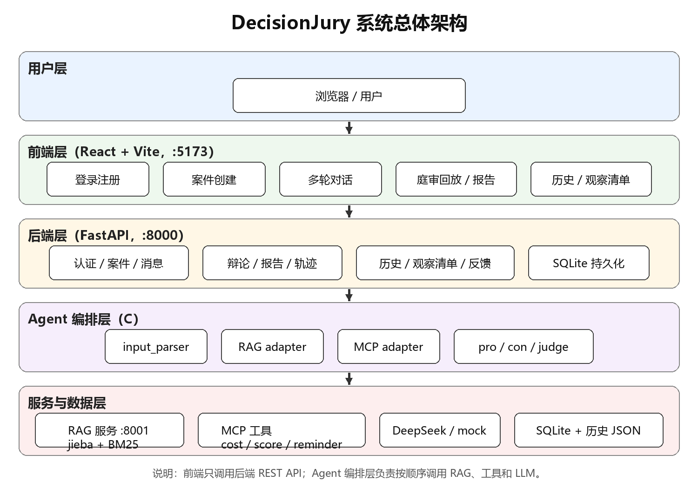

图 3-1 系统总体架构图

### 3.2.2 模块职责设计

| 模块 | 主要职责 | 不承担的职责 |
|---|---|---|
| A 前端 | 页面展示、表单交互、多轮对话、庭审回放、报告与 trace 展示 | 不直接调用 LLM、RAG 或工具 |
| B 后端 | REST API、用户与案件状态、SQLite 持久化、鉴权、报告/trace/提醒/历史管理 | 不替代 C 的字段解析和判决规则 |
| C Agent | 输入解析、正反方独立陈述、规则法官与模型说明、RAG/MCP adapter | 不直接向数据库写提醒 |
| D RAG | jieba + BM25 检索、静态与实时历史合并、证据契约 | 不生成最终建议，不编造历史 |
| E 工具 | 成本分析、决策评分、冷静期提醒、统一调用入口、日志、测试与部署脚本 | 不决定案件状态和最终结论 |

### 3.2.3 接口设计

| 方法 | 路径 | 功能 | 实现方 | 主要调用方 |
|---|---|---|---|---|
| POST | `/auth/register` | 用户注册 | B | A |
| POST | `/auth/login` | 用户登录，返回 Token | B | A |
| GET | `/api/health` | 健康检查 | B | 全员 |
| POST | `/api/cases` | 创建案件 | B | A |
| GET | `/api/cases` | 查询案件列表 | B | A |
| GET | `/api/cases/{case_id}` | 查询案件详情 | B | A/C |
| PATCH | `/api/cases/{case_id}` | 更新案件字段 | B | A/B |
| DELETE | `/api/cases/{case_id}` | 删除案件（历史软删除） | B | A |
| POST | `/api/cases/{case_id}/messages` | 多轮补充信息 | B/C | A |
| GET | `/api/cases/{case_id}/messages` | 查询消息列表 | B | A |
| POST | `/api/cases/{case_id}/debate` | 启动 Agent 分析 | B/C | A |
| GET | `/api/cases/{case_id}/report` | 查询决策报告 | B/C | A |
| GET | `/api/cases/{case_id}/trace` | 查询执行轨迹 | B/C | A |
| POST | `/api/cases/{case_id}/feedback` | 提交决策复盘 | B | A |
| GET | `/api/history` | 查询历史记录 | B/D | A/D |
| POST | `/api/history` | 新增历史记录 | B/D | A |
| GET | `/api/watchlist` | 查询观察清单 | B/E | A |
| DELETE | `/api/watchlist/{reminder_id}` | 取消提醒 | B/E | A |
| POST | `/api/rag/search` | RAG 检索 | D | C |
| POST | `/api/tools/cost-analyzer` | 成本分析 | E | 独立调用/演示 |
| POST | `/api/tools/cooling-reminder` | 冷静期提醒 | E | 独立调用/演示 |
| POST | `/api/tools/decision-score` | 决策评分 | E | 独立调用/演示 |

接口统一返回 `{success, data, message}` 结构，字段使用 `snake_case`，枚举值使用小写 `snake_case`。C 主流程通过 `backend/app/services/mcp_adapter.py` 直接调用 `mcp_tools.mcp.call_tool`，不绕回 HTTP 工具路由；独立 HTTP 工具接口用于演示和联调。

### 3.2.4 前端页面设计

| 页面 | 主要功能 | 关键交互 |
|---|---|---|
| 登录/注册页 | 用户认证 | 输入账号密码，登录后保存 Token |
| 首页/案件创建页 | 创建购物案件 | 输入自然语言描述，选择或识别案件类型 |
| 多轮对话页 | 补充和纠正信息 | 展示追问、已收集字段、消息列表；支持刷新恢复 |
| 庭审回放/报告页 | 展示分析结果 | 展示书记员、正方、反方、法官四条事件、RAG 证据和工具结果 |
| 判决书页 | 展示最终报告 | 展示最终裁决、理由、后续动作 |
| 执行轨迹页 | 展示 trace | 展示 Agent、RAG、工具调用的顺序、耗时和状态 |
| 历史记录页 | 查看历史复盘 | 分页展示历史记录和结果标签 |
| 观察清单页 | 查看待复盘提醒 | 展示到期时间，支持取消提醒 |

## 3.3 关键算法说明

### 3.3.1 输入解析与字段合并算法

输入解析 Agent 的职责是把用户自然语言转换为结构化字段，并维护多轮累计状态。其处理步骤如下：

1. 对输入进行文本规范化，使用本地规则识别购物意图、价格、预算、用途、替代品、使用频率和触发原因。
2. 如果配置了 DeepSeek API Key，调用 `complete_parser_json` 进行结构化解析；如果未配置、请求失败或返回字段不合法，则使用本地规则结果，保证多轮收集不中断。
3. 将本轮 `extracted_fields` 与历史累计字段合并，得到 `merged_fields`。同名非空字段允许覆盖旧值，明确的 `correction_fields` 最后覆盖。
4. 检查最低必需字段 `product_name / price / monthly_budget_left` 是否齐全，以及是否存在未解决冲突；满足条件时状态为 `ready_for_debate`，否则保持 `collecting`。
5. 生成 `missing_fields`、`field_meta`、`conflicts`、`next_question` 等辅助信息，供后端和前端展示。

价格和预算识别采用分句上下文限制：金额上下文限制在标点分句内，避免后面的“预算”关键词吞掉前面的价格；对于“不是 2500，是 2200”这类明确纠正，更新价格而不影响预算。该规则能够覆盖常见口语表达，但不保证理解任意歧义输入。

### 3.3.2 多 Agent 编排算法

Agent 编排采用顺序执行方式，由 `backend/app/orchestrator/decision_flow.py` 统一控制。输入解析完成后，如果状态不是 `ready_for_debate`，流程直接返回缺失字段和追问信息；否则依次执行检索、工具和 Agent。

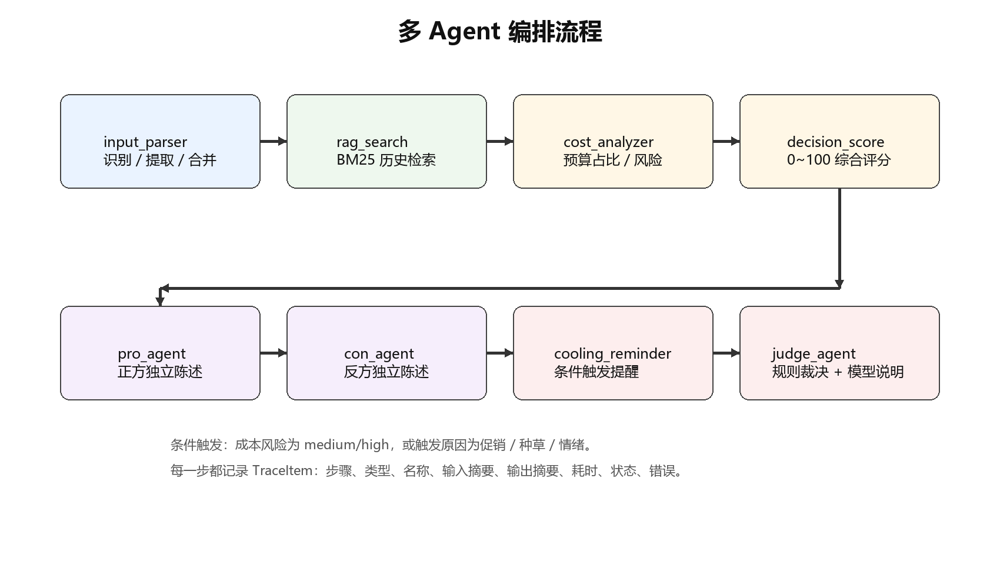

图 3-2 多 Agent 编排流程图

实际调用顺序为：

```text
input_parser
  → rag_search
  → cost_analyzer
  → decision_score
  → pro_agent
  → con_agent
  → cooling_reminder（条件触发）
  → judge_agent
```

- `input_parser`：识别案件类型、提取字段、合并历史字段、标记高风险主题。
- `rag_search`：调用 RAG 服务检索历史证据；编排层使用严格模式区分“服务失败”和“正常无结果”。
- `cost_analyzer`：计算预算占比和风险等级。
- `decision_score`：生成 0~100 综合评分，作为法官的参考依据。
- `pro_agent`：分析购买收益和使用价值。
- `con_agent`：独立分析预算、闲置、替代和冲动风险，不读取正方结果。
- `cooling_reminder`：成本风险为 medium/high 或触发原因为促销、种草、情绪时创建提醒。
- `judge_agent`：本地规则确定 `final_decision` 和 `confidence`，再调用模型生成自然语言说明。

每一步都会写入 `TraceItem`，记录步骤序号、类型、名称、输入摘要、输出摘要、耗时、状态和错误信息。工具失败时使用 fallback 结果，主流程继续执行。

### 3.3.3 RAG 检索算法

RAG 服务使用 jieba 分词和 BM25 算法完成检索，核心流程如下：

1. 根据请求中的 `case_type` 过滤历史记录，保证购物和时间的证据隔离。
2. 将每条记录的 `title + content + tags` 拼接后使用 `jieba.lcut_for_search` 分词，构建 BM25 语料库。
3. 对用户查询同样使用 `jieba.lcut_for_search` 分词，计算 BM25 得分。
4. 只保留得分大于 0 的记录，按得分降序排列，并按标题去重，保留每个标题得分最高的一条。
5. 截取前 `top_k` 条结果，裁剪为 `RagEvidence` 契约字段返回；没有命中时返回空数组。

BM25 的核心得分公式为：

```text
score(D, Q) = Σ IDF(q_i) · [ f(q_i, D) · (k_1 + 1) ] / [ f(q_i, D) + k_1 · (1 - b + b · |D| / avgdl) ]
```

其中 `f(q_i, D)` 是词 `q_i` 在文档 `D` 中的词频，`|D|` 是文档长度，`avgdl` 是平均文档长度，`k_1` 和 `b` 是调节参数。BM25 对词频饱和和文档长度进行归一化，适合当前 500 条短文本历史记录的检索场景。

RAG 数据来源包括两部分：静态文件 `data/history_records.json` 中的 500 条模拟记录，以及每次检索时按 `user_id` 从后端 `GET /api/history` 拉取的实时历史。两部分数据按 `id` 去重合并，实时数据优先；后端不可用时自动回退到静态数据。该设计使前端新提交的决策复盘有机会被下一次检索命中，形成历史闭环。

### 3.3.4 成本分析算法

成本分析工具根据购物场景计算预算占比和风险等级：

```text
budget_ratio = price / monthly_budget_left
```

当剩余预算为 0 时，实现中取 `budget_ratio = 1.0`。风险等级判定规则为：

| 预算占比 | 风险等级 |
|---|---|
| `budget_ratio ≤ 0.2` | `low` |
| `0.2 < budget_ratio ≤ 0.6` | `medium` |
| `budget_ratio > 0.6` | `high` |

例如，价格 1299 元、剩余预算 2000 元时，占比约为 0.65，风险等级为 `high`；剩余预算 3000 元时，占比约为 0.43，风险等级为 `medium`。工具同时返回购买后的剩余预算 `budget_left_after_purchase`，并写入调用日志。价格或预算为负数时返回失败结果，由上层转成 `failed ToolResult`。

### 3.3.5 决策评分算法

决策评分工具是纯规则计算，不依赖大语言模型，综合成本压力、历史风险、使用价值和冲动触发四个维度：

```text
score = 50 + cost_delta + history_delta + usage_delta + impulse_delta
```

其中：

- `cost_delta`：成本风险为 low 时 +15，medium 时 0，high 时 −20。
- `history_delta = (0.5 − history_risk) × 30`，历史风险越高扣分越多。
- `usage_delta = (usage_value − 0.5) × 40`，使用价值越高加分越多。
- `impulse_delta`：冲动触发时为 −10，否则为 0。
- 最终分数限制在 0~100 之间。

评分等级为：`score ≥ 70` 为 low，`45 ≤ score < 70` 为 medium，`score < 45` 为 high。评分结果进入法官上下文作为参考，但当前法官规则不直接使用评分数值替换最终结论。

### 3.3.6 法官裁决算法

法官 Agent 的最终结论由本地规则确定，优先级如下：

1. 成本工具成功且风险等级为 `high` → `reject`。
2. 成本风险为 `medium`，或触发原因为促销、种草、情绪，或 RAG 证据带 `idle / regret / budget` 标签 → `delay`。
3. 有非空且不是“无/没有”的替代品 → `alternative`。
4. 使用频率为每天、每日、经常、高频 → `buy`。
5. 其他情况 → `delay`。

法官置信度由启发式规则计算：基础 0.72，有 RAG 证据加 0.08，无证据减 0.12，成本工具成功加 0.05，工具失败减 0.10，最终限制在 0.30~0.90。大语言模型接收规则结论、双方观点、RAG 证据和工具结果，只生成自然语言说明；如果模型调用失败，则使用本地说明。该设计保证最终结论稳定、可复现，也避免模型幻觉直接影响裁决结果。

### 3.3.7 冷静期提醒算法

冷静期提醒工具在成本风险为 medium/high，或购买触发原因为促销、种草、情绪时被调用。默认冷静期为 3 天，工具生成 `reminder_id` 和 `due_at`，并返回观察项，例如“是否仍然需要”“是否已有低价替代品”“是否影响本月必要支出”。提醒数据由后端写入 `reminders` 表，状态为 `waiting`，前端观察清单页面可以查询和取消。工具状态 `scheduled` 与数据库状态 `waiting` 属于不同层次，前者表示工具调用结果，后者表示观察清单中的待复盘状态。

## 3.4 原型图设计

### 3.4.1 登录与注册页面

登录页面包含账号、密码输入框和登录按钮，登录成功后保存 Token 并跳转到首页。注册页面包含账号、昵称和密码输入，注册成功后可以返回登录页。页面需要给出明确的错误提示，例如“用户不存在”“密码错误”。

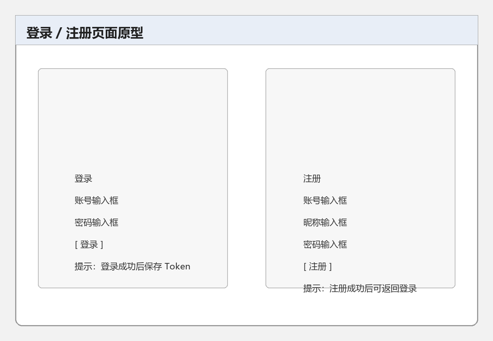

图 3-3 登录 / 注册页面原型

### 3.4.2 案件创建页面

案件创建页面提供自然语言输入框和示例提示，用户输入类似“我想买一副 1299 元的降噪耳机，最近学习需要安静”的描述后提交。系统创建案件并返回 `case_id`、当前状态和下一步追问。页面需要展示高风险提示和输入示例，帮助用户理解系统只支持低风险购物决策。

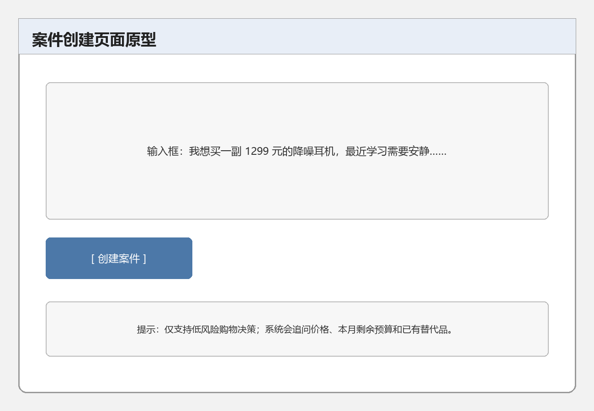

图 3-4 案件创建页面原型

### 3.4.3 多轮对话页面

多轮对话页面按时间顺序展示用户消息和系统回复，同时展示已收集字段、缺失字段和当前状态。用户补充“本月预算还剩 3000 元，已有普通耳机”后，页面更新字段并提示可以开始分析。页面支持刷新后重新拉取消息列表。

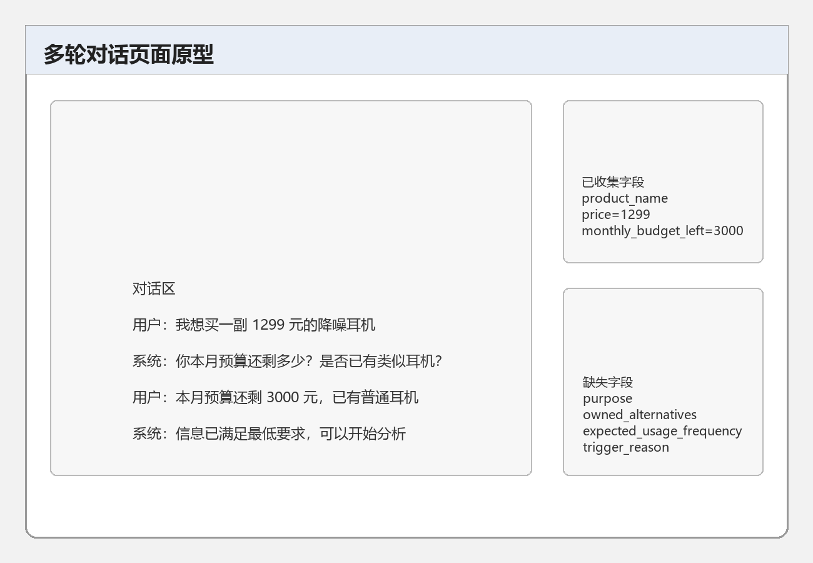

图 3-5 多轮对话页面原型

### 3.4.4 庭审回放与判决书页面

庭审回放页面按顺序展示四条结构化事件：书记员案件摘要、正方独立陈述、反方独立陈述、法官判决。判决书页面展示案件摘要、正反观点、RAG 证据、工具结果、最终裁决和后续动作。页面下方可以展示执行轨迹，帮助答辩时说明每一步的调用顺序和耗时。

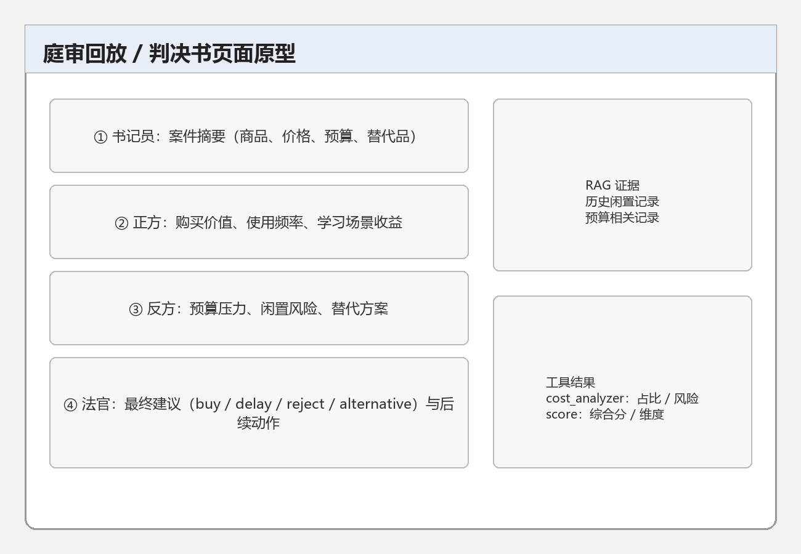

图 3-6 庭审回放 / 判决书页面原型

### 3.4.5 历史记录与观察清单页面

历史记录页面展示用户过去的决策复盘，包括标题、摘要、结果标签和创建时间。观察清单页面展示待复盘的提醒，包括标题、原因、到期时间和状态，支持取消提醒。用户提交复盘后，历史记录增加，相关提醒状态更新。

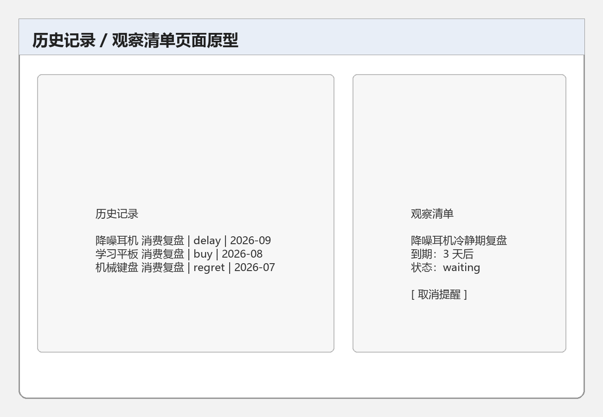

图 3-7 历史记录 / 观察清单页面原型

---

# 04 项目实现

> 负责人：C，A/B/D/E 配合
> 状态：已完成

---

## 4.1 总体实现

### 4.1.1 系统总体架构

系统总体架构如图 3-1 所示。前端运行在 5173 端口，只调用后端 REST API；后端运行在 8000 端口，负责业务接口、状态管理、持久化和 Agent 编排；RAG 服务运行在 8001 端口，通过 HTTP 接口提供 BM25 检索；工具模块以 Python 函数和统一 `call_tool` 入口被编排层调用；大语言模型通过 HTTPS 调用 DeepSeek API，未配置密钥或调用失败时回退到 mock。

### 4.1.2 项目目录结构

| 目录 | 主要内容 | 负责模块 |
|---|---|---|
| `frontend/` | React + TypeScript + Vite 前端，页面、组件、API 封装、认证上下文 | A |
| `backend/routers/` | FastAPI 路由：认证、案件、消息、辩论、报告、轨迹、历史、观察清单、工具 | B |
| `backend/models.py` | SQLAlchemy 数据模型：用户、案件、消息、历史、轨迹、提醒 | B |
| `backend/app/agents/` | 输入解析、正方、反方、法官四个 Agent | C |
| `backend/app/orchestrator/` | 顺序编排、C-B adapter、命令行 demo | C |
| `backend/app/services/` | LLM 客户端、RAG adapter、MCP adapter、mock 服务 | C |
| `rag/` | BM25 检索服务、数据加载、评测脚本、Dockerfile | D |
| `mcp_tools/` | 成本分析、决策评分、冷静期提醒、统一调用入口、日志 | E |
| `tests/` | 后端、Agent、RAG、工具和接口测试 | 全员 |
| `data/` | 历史样本、演示数据、RAG 评测结果 | D |
| `deploy/` | Linux screen 部署脚本、Docker 部署文档 | E |
| `docs/` | 项目文档、接口契约、测试计划和本报告框架 | 全员 |

### 4.1.3 后端实现

后端使用 FastAPI 构建，按路由、模型、服务和编排分层。主要路由模块如下：

| 路由模块 | 主要接口 | 功能 |
|---|---|---|
| `auth.py` | `POST /auth/register`、`POST /auth/login` | 用户注册、登录、签发 JWT |
| `cases.py` | `/api/cases`、`/api/cases/{case_id}` | 案件创建、查询、列表、更新、删除、报告 |
| `chat.py` | `/api/cases/{case_id}/messages` | 多轮消息、字段解析与合并、消息列表 |
| `debate.py` | `POST /api/cases/{case_id}/debate` | 校验用户和案件状态，调用 Agent 编排 |
| `history.py` | `/api/history` | 历史记录查询和新增 |
| `watchlist.py` | `/api/watchlist` | 观察清单查询和取消 |
| `tools.py` | `/api/tools/*` | 工具 HTTP 入口 |
| `trace` 相关逻辑 | `GET /api/cases/{case_id}/trace` | 执行轨迹查询 |

后端启动时创建数据库表并执行结构检查；开发环境结构不一致时可以自动重建，生产环境执行迁移。接口统一返回 `{success, data, message}`，并在全局异常处理器中统一转换数据库错误、校验错误和业务错误。

### 4.1.4 前端实现

前端使用 React 18 + TypeScript + Vite，主要页面包括 `HomePage`、`CreateCasePage`、`ChatPage`、`VerdictPage`、`HistoryPage`、`WatchlistPage`、`LoginPage` 和 `RegisterPage`。公共组件包括 `AppLayout`、`TraceLogView`、`FeedbackModal` 和 `ThinkingOverlay`；认证相关代码位于 `auth/` 目录，API 封装位于 `api/index.ts` 和 `api/auth.ts`。

前端通过统一 REST 客户端调用后端接口，登录成功后保存 Token，并在请求头中携带；页面支持案件创建、多轮对话、庭审事件渐进展示、报告查看、历史记录和观察清单操作。前端不直接调用大语言模型、RAG 或工具，所有数据都通过后端接口获取。

### 4.1.5 RAG 服务实现

RAG 服务是一个独立的 FastAPI 应用，入口为 `rag/retriever.py`，对外提供 `POST /api/rag/search`。数据加载由 `rag/data_loader.py` 完成：先读取静态文件 `data/history_records.json`，再尝试按 `user_id` 从后端 `GET /api/history` 拉取实时历史；两部分数据按 `id` 去重合并，实时数据优先；后端不可用时回退静态数据。检索时使用 jieba 分词和 BM25Okapi 计算得分，按 `case_type` 隔离，按得分排序并按标题去重，最后裁剪为 `RagEvidence` 契约字段返回。没有命中时返回空数组。

### 4.1.6 工具模块实现

工具模块位于 `mcp_tools/`，包含 `cost_analyzer.py`、`decision_score.py`、`cooling_reminder.py`、`logger.py` 和 `mcp.py`。`mcp.py` 定义工具 schema 和统一入口 `call_tool(name, arguments)`，成功和失败都返回 `ToolResult` 兼容结构；`logger.py` 记录工具名、输入、输出和耗时，便于答辩取证。Agent 编排层通过 `backend/app/services/mcp_adapter.py` 调用 `call_tool`，把工具结果转换为 C 模块统一的 `ToolResult` 对象。后端另外提供独立的 `/api/tools/*` HTTP 接口，用于演示和联调，但主流程不绕回 HTTP 路由。

### 4.1.7 数据库实现

数据库使用 SQLite，表结构由 SQLAlchemy 定义。`users` 保存账号和密码哈希；`cases` 保存案件状态、累计字段、最终裁决和完整辩论结果 JSON；`messages` 保存多轮消息；`histories` 保存复盘历史，并支持软删除；`traces` 保存 Agent 执行轨迹；`reminders` 保存冷静期提醒。关键外键设置了级联删除，常用查询字段建立了复合索引。

### 4.1.8 部署与启动实现

项目提供三种启动方式：

- Windows 一键启动：根目录 `start_all.bat` 启动后端、RAG 和前端，`stop_all.bat` 停止服务。
- Linux 开发演示：`deploy/install.sh` 安装依赖，`deploy/start.sh` 使用 screen 启动三个服务，`deploy/stop.sh` 停止服务。
- Docker Compose：`docker-compose.yml` 编排前端 Nginx、后端和 RAG 三个服务，详细说明见 `deploy/DOCKER.md`。

默认端口为前端 5173、后端 8000、RAG 8001。后端健康检查地址为 `http://127.0.0.1:8000/api/health`，Swagger 文档为 `http://127.0.0.1:8000/docs`，RAG Swagger 为 `http://127.0.0.1:8001/docs`。

## 4.2 关键技术实现

### 4.2.1 输入解析与多轮字段合并

输入解析 Agent 在 `backend/app/agents/input_parser.py` 中实现。它先构建本地规则结果，再尝试调用 DeepSeek 解析；模型失败时保留本地结果，保证多轮收集不中断。核心代码结构如下：

```python
# backend/app/agents/input_parser.py
def parse_input(raw_input: str, existing_collected_fields: dict | None = None) -> ParserResult:
    existing = existing_collected_fields or {}
    normalized_input = _normalize_text(raw_input)
    high_risk = _is_high_risk(normalized_input)

    local_result = _build_rule_result(normalized_input, existing)
    if high_risk:
        local_result.is_high_risk = True
        local_result.reject_reason = "high_risk_domain"

    client = get_llm_client()
    if isinstance(client, DeepSeekLLMClient):
        try:
            llm_result = client.complete_parser_json({
                "current_message": normalized_input,
                "existing_collected_fields": existing,
                "existing_missing_fields": local_result.missing_fields,
            })
            return _build_llm_result(llm_result, existing)
        except Exception as exc:
            local_result.parser_used = "local_fallback"
            local_result.agent_step.error = f"deepseek_parser_failed: {type(exc).__name__}"
            return local_result
    return local_result
```

字段合并时，本轮 `extracted_fields` 与历史字段合并为 `merged_fields`；同名非空字段可以覆盖旧值，`correction_fields` 最后覆盖。最低必需字段为 `product_name`、`price`、`monthly_budget_left`，三项齐全且没有冲突时案件进入 `ready_for_debate`。

### 4.2.2 多 Agent 顺序编排

编排入口为 `backend/app/orchestrator/decision_flow.py` 中的 `run_decision_flow`。它按固定顺序调用输入解析、RAG、成本分析、决策评分、正方、反方、条件触发的冷静期提醒和法官，并为每一步记录 trace。核心片段如下：

```python
# backend/app/orchestrator/decision_flow.py
parser_result = _record_agent_trace(trace, "input_parser", raw_input,
    lambda: parse_input(raw_input, existing_collected_fields))
steps.append(parser_result.agent_step)

if parser_result.case_status != "ready_for_debate":
    return DebateResult(success=False, message="MISSING_FIELDS", ...)

fields = parser_result.merged_fields
query = _build_rag_query(fields)
rag_evidence = _record_trace(trace, "rag_search", "rag_search", query,
    func=lambda: search_rag_evidence(user_id, case_id, "shopping", query,
                                     top_k=3, raise_on_error=True),
    fallback=[])

tool_results = [_record_trace(trace, "tool_call", "cost_analyzer", ...,
    func=lambda: analyze_shopping_cost(case_id, "shopping", fields), ...)]
tool_results.append(_record_trace(trace, "tool_call", "decision_score", ...,
    func=lambda: score_decision(case_id, "shopping", fields, rag_evidence, tool_results[0]), ...))

pro_step = _record_agent_trace(trace, "pro_agent", ..., lambda: run_pro_agent(...))
con_step = _record_agent_trace(trace, "con_agent", ..., lambda: run_con_agent(...))

if _should_create_reminder(tool_results, fields):
    tool_results.append(_record_trace(trace, "tool_call", "cooling_reminder", ...))

judge_step, report = _record_agent_trace(trace, "judge_agent", ...,
    lambda: run_judge_agent(...))
```

`_record_trace` 在 try/except 中执行每一步，成功时记录 `completed` 和耗时，失败时记录 `failed` 和错误信息，并在提供 fallback 时返回降级结果。这样即使 RAG 或工具失败，正方、反方和法官流程仍然可以继续。

### 4.2.3 RAG 检索实现

RAG 检索的核心代码位于 `rag/retriever.py`：

```python
# rag/retriever.py
all_records = load_history_data(request.user_id)
filtered_records = [
    r for r in all_records
    if r.get("case_type") == request.case_type
    and (r.get("title") or "") and (r.get("content") or "")
]
if not filtered_records:
    return {"success": True, "data": {"results": []}, "message": ""}

corpus = []
for record in filtered_records:
    text_to_cut = record.get("title", "") + " " + record.get("content", "") + " " + " ".join(record.get("tags") or [])
    corpus.append(jieba.lcut_for_search(text_to_cut))

bm25 = BM25Okapi(corpus)
tokenized_query = [w.strip() for w in jieba.lcut_for_search(request.query) if w.strip()]
scores = bm25.get_scores(tokenized_query)

matched_results = []
for i, record in enumerate(filtered_records):
    score = round(float(scores[i]), 4)
    if score > 0:
        matched_results.append(_to_rag_evidence_item(record, score))

matched_results.sort(key=lambda x: x["score"], reverse=True)

seen_titles = set()
deduped_results = []
for item in matched_results:
    if item["title"] in seen_titles:
        continue
    seen_titles.add(item["title"])
    deduped_results.append(item)

final_results = deduped_results[: request.top_k]
```

这段实现体现了三个关键点：查询和语料统一使用 `lcut_for_search`，避免长词切分不一致导致漏检；按 `case_type` 隔离，避免购物证据出现在时间场景；按标题去重，避免同一商品的重复记录挤占 top_k。

### 4.2.4 成本分析与决策评分实现

成本分析工具的核心计算如下：

```python
# mcp_tools/cost_analyzer.py
budget_ratio = price / monthly_budget_left if monthly_budget_left > 0 else 1.0
budget_left_after = monthly_budget_left - price

if budget_ratio <= 0.2:
    risk_level = "low"
elif budget_ratio <= 0.6:
    risk_level = "medium"
else:
    risk_level = "high"
```

决策评分工具的核心公式如下：

```python
# mcp_tools/decision_score.py
cost_delta = {"low": 15, "medium": 0, "high": -20}[cost_risk_level]
history_delta = round((0.5 - history_risk) * 30, 2)
usage_delta = round((usage_value - 0.5) * 40, 2)
impulse_delta = -10 if impulse_trigger else 0

score = max(0, min(100, round(50 + cost_delta + history_delta + usage_delta + impulse_delta)))
```

两个工具都通过 `mcp_tools/mcp.py` 的 `call_tool` 统一分发，返回值包含 `tool_name`、`status`、`summary`、`risk_level`、`metrics` 和 `error` 六个字段。参数缺失或非法时返回 `status=failed`，不会伪造有效计算结果。

### 4.2.5 法官规则与模型说明

法官 Agent 在 `backend/app/agents/judge_agent.py` 中实现。最终裁决由本地规则 `_decide` 决定：

```python
# backend/app/agents/judge_agent.py
def _decide(fields, rag_evidence, cost_result):
    risk_level = cost_result.risk_level if cost_result and cost_result.status == "success" else None
    alternatives = str(fields.get("owned_alternatives", ""))
    frequency = str(fields.get("expected_usage_frequency", ""))
    trigger = str(fields.get("trigger_reason", ""))
    has_risk_history = any(any(tag in item.tags for tag in ["idle", "regret", "budget"])
                           for item in rag_evidence)

    if risk_level == "high":
        return "reject"
    if risk_level == "medium" or trigger in {"促销", "种草", "情绪"} or has_risk_history:
        return "delay"
    if alternatives not in {"无", "没有"} and alternatives:
        return "alternative"
    if frequency in {"每天", "每日", "经常", "高频"}:
        return "buy"
    return "delay"
```

规则确定 `final_decision` 和 `confidence` 后，`_generate_judge_explanation` 调用 DeepSeek 生成自然语言说明；如果模型不可用或返回异常，则使用本地 `_summary` 和 `_judge_arguments`。这样既保留了模型的语言组织能力，又保证裁决结果不被模型幻觉覆盖。

### 4.2.6 JWT 登录与双模式鉴权

后端在 `backend/security.py` 中实现 JWT 认证。密码使用 bcrypt 哈希存储，登录成功后签发 Token；接口通过 `get_current_user_optional` 依赖解析 Token。默认 `ENFORCE_JWT=false`，采用双模式：请求携带有效 Token 时优先使用 Token 中的用户 ID，未携带 Token 时兼容旧的 `user_id` 参数；当 `ENFORCE_JWT=true` 时，无 Token 或 Token 无效直接返回 401。核心逻辑如下：

```python
# backend/security.py
def get_current_user_optional(token=Depends(oauth2_scheme), db=Depends(get_db)):
    if not token:
        if Config.ENFORCE_JWT:
            raise HTTPException(status_code=401, detail={"code": "UNAUTHORIZED"})
        return None
    user_id = decode_access_token(token)
    if user_id is None:
        if Config.ENFORCE_JWT:
            raise HTTPException(status_code=401, detail={"code": "INVALID_TOKEN"})
        return None
    return db.query(User).filter(User.id == user_id).first()
```

路由层通过 `current_user.id if current_user else req.user_id` 得到有效用户 ID，并对案件、提醒等资源做所属用户比较，避免不同用户互相访问数据。

### 4.2.7 前端关键实现

前端 API 封装位于 `frontend/src/api/index.ts`，统一处理请求路径、Token 和错误提示；认证状态由 `frontend/src/auth/AuthContext.tsx` 管理，登录后把 Token 保存到本地存储。庭审事件展示由 `frontend/src/components/TraceLogView.tsx` 完成，按顺序展示书记员、正方、反方和法官事件，并支持渐进播放。`frontend/src/pages/ChatPage.tsx` 负责多轮对话和消息列表刷新，`VerdictPage.tsx` 负责报告展示，`WatchlistPage.tsx` 负责观察清单操作。

### 4.2.8 异常处理与降级策略

系统的异常处理遵循“主流程不中断、结果可解释”的原则：

| 异常场景 | 处理方式 |
|---|---|
| 未配置 DeepSeek Key | 输入解析使用本地规则，正反方使用 mock，法官使用本地说明 |
| DeepSeek 请求超时或返回非 JSON | 回退 mock 或本地规则，trace 记录错误 |
| RAG 服务不可用 | 返回空证据，trace 标记 `failed`，Agent 流程继续 |
| RAG 正常无命中 | 返回空数组，trace 标记 `completed`，法官说明未找到历史证据 |
| 工具参数非法 | 返回 `status=failed` 的 `ToolResult`，不伪造指标 |
| 工具调用异常 | 使用 fallback 结果，法官提示用户手动核对 |
| 高风险输入 | 后端拒绝路径返回拒绝结果，不进入正常庭审 |
| 用户无权访问案件/提醒 | 返回 `FORBIDDEN`，不泄露他人数据 |

---

# 05 项目测试

> 负责人：E，A/B/C/D 配合
> 状态：已完成（测试结果以实际执行为准，已知失败项如实记录）

---

## 5.1 测试环境与部署

### 5.1.1 测试环境

| 项目 | 内容 |
|---|---|
| 操作系统 | Windows |
| Python | 3.14.2 |
| 包管理 | uv 0.11.28 |
| 测试框架 | pytest 9.1.1 |
| 数据库 | SQLite 内存库（`sqlite:///:memory:`） |
| 模型 | 未配置真实 DeepSeek Key，使用本地规则和 mock 兜底 |
| RAG | 关闭实时历史拉取（`RAG_LIVE_RECORDS=0`），使用静态 500 条样本 |
| 前端 | React + Vite，Node.js/npm 依赖已安装 |

测试使用独立终端和内存数据库，避免 TestClient 启动时的数据库检查影响日常数据库。测试前设置以下环境变量：

```bash
export DATABASE_URL="sqlite:///:memory:"
export ENV=development
export DEEPSEEK_API_KEY=""
export PYTHON_DOTENV_DISABLED=1
export RAG_LIVE_RECORDS=0
export PYTHONIOENCODING=utf-8
```

### 5.1.2 测试命令

```bash
# 全量测试
uv run --frozen pytest -p no:cacheprovider tests -q --tb=line --show-capture=no

# C Agent/LLM/adapter 定向测试
uv run --frozen pytest -p no:cacheprovider tests/test_input_parser.py \
  tests/test_llm_client.py tests/test_judge_agent.py tests/test_agent_flow.py \
  tests/test_mcp_adapter.py tests/test_rag_adapter.py

# RAG 定向测试
uv run --frozen pytest -p no:cacheprovider tests/test_rag.py \
  tests/test_rag_data_loader.py tests/test_dialogue_quality_metrics.py \
  tests/test_rag_standard_metrics.py

# 工具定向测试
uv run --frozen pytest -p no:cacheprovider tests/test_cost_analyzer.py \
  tests/test_cooling_reminder.py tests/test_decision_score.py \
  tests/test_mcp_tools.py tests/test_tools_router.py

# B 后端路由与迁移测试
uv run --frozen pytest -p no:cacheprovider tests/test_cases_router.py \
  tests/test_chat_router.py tests/test_debate_router.py tests/test_history_router.py \
  tests/test_watchlist_router.py tests/test_feedback_router.py \
  tests/test_trace_route.py tests/test_health_route.py tests/test_migrate.py
```

### 5.1.3 部署与启动

Windows 环境使用根目录 `start_all.bat` 一键启动前端、后端和 RAG 三个服务；停止使用 `stop_all.bat`。Linux 环境使用 `deploy/install.sh`、`deploy/start.sh` 和 `deploy/stop.sh` 通过 screen 启动和停止。容器环境使用 `docker-compose.yml` 编排前端 Nginx、后端和 RAG 服务，详细说明见 `deploy/DOCKER.md`。默认地址为前端 `http://localhost:5173/`、后端健康检查 `http://127.0.0.1:8000/api/health`、后端 Swagger `http://127.0.0.1:8000/docs`、RAG Swagger `http://127.0.0.1:8001/docs`。

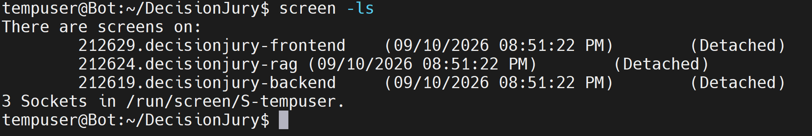

图 5-3 服务启动（screen -ls）

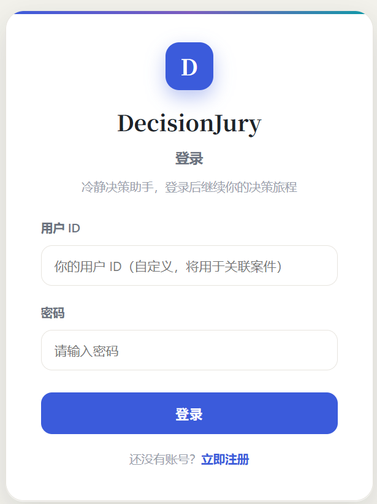

图 5-4 登录页面

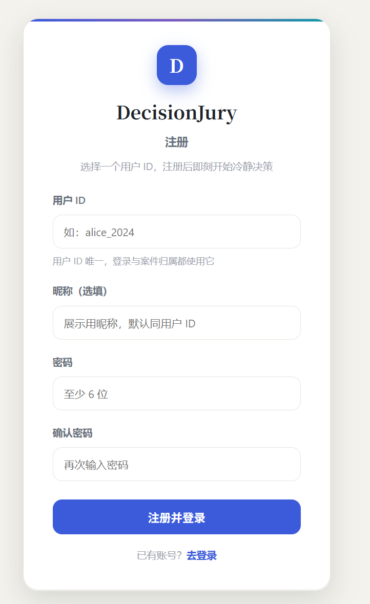

图 5-5 注册页面

## 5.2 测试策略与测试用例

测试按四层组织：

| 层次 | 要验证的内容 | 不能替代的验证 |
|---|---|---|
| 静态核对 | 字段、路由、规则、文档与代码一致 | 真实运行和部署 |
| 单元/契约测试 | 规则、schema、mock 响应、adapter 和隔离路由行为 | 真实 DeepSeek 质量、浏览器体验 |
| 真实 API 验收 | parser、正反方、法官说明实际调用模型且没有静默降级 | 整个 Web 持久化闭环 |
| 端到端/页面 | 注册 → 创建 → 补充 → 庭审/报告 → 提醒 → 复盘 | 生产安全和可靠性 |

主要测试文件与覆盖功能如下：

| 测试文件 | 覆盖功能 |
|---|---|
| `tests/test_input_parser.py` | 商品、价格、预算、纠正、中文金额、高风险标记 |
| `tests/test_llm_client.py` | DeepSeek 请求构造、超时、异常和 mock fallback |
| `tests/test_judge_agent.py` | 法官规则、置信度、模型说明 fallback |
| `tests/test_agent_flow.py` | 多 Agent 编排、RAG/MCP 接入、trace、异常兜底 |
| `tests/test_mcp_adapter.py` | C-E 工具 adapter 转换 |
| `tests/test_rag_adapter.py` | C-D RAG adapter 契约 |
| `tests/test_rag.py` | BM25 检索、类型隔离、标题去重、防幻觉 |
| `tests/test_rag_data_loader.py` | 静态与实时历史合并、回退和开关 |
| `tests/test_rag_standard_metrics.py` | P/R/MRR/NDCG 指标计算 |
| `tests/test_dialogue_quality_metrics.py` | 对话质量代理指标 |
| `tests/test_cost_analyzer.py` | 预算占比、风险等级、边界校验 |
| `tests/test_decision_score.py` | 评分公式、风险等级、参数校验 |
| `tests/test_cooling_reminder.py` | 提醒生成、默认天数、业务错误 |
| `tests/test_mcp_tools.py` | 统一 `call_tool` 分发和失败结果 |
| `tests/test_tools_router.py` | 工具 HTTP 接口 |
| `tests/test_cases_router.py` | 案件创建、查询、列表、报告 |
| `tests/test_chat_router.py` | 多轮消息、字段提取、状态流转 |
| `tests/test_debate_router.py` | 辩论启动、错误处理、拒绝路径 |
| `tests/test_history_router.py` | 历史记录 CRUD、分页、枚举校验 |
| `tests/test_watchlist_router.py` | 观察清单查询、排序、权限 |
| `tests/test_feedback_router.py` | 复盘提交、满意度映射、历史联动 |
| `tests/test_trace_route.py` | 执行轨迹查询、排序、字段完整性 |
| `tests/test_health_route.py` | 健康检查 |
| `tests/test_migrate.py` | 数据库迁移函数 |

## 5.3 测试执行结果

### 5.3.1 全量测试结果

在最新 `dev@c1ff634`（含 JWT 身份契约测试对齐、迁移字段补全、前端输入锁定）上执行全量测试，实际结果如下：

```text
命令：uv run --frozen pytest -p no:cacheprovider tests -q --tb=line --show-capture=no
结果：292 passed, 5 failed, 7 warnings in 35.99s
```

### 5.3.2 定向测试结果

按模块拆分执行定向测试，结果如下：

| 测试分组 | 实际结果 | 耗时 |
|---|---|---|
| C Agent/LLM/RAG-MCP adapter | 139 passed | 28.94s |
| D RAG 检索、数据加载、评测指标 | 18 passed | 0.99s |
| E MCP 工具、评分、提醒、工具路由 | 59 passed | 0.23s |
| B 后端路由、消息、辩论、历史、观察清单、轨迹、迁移 | 71 passed, 5 failed | 5.81s |

> 说明：前四行按 A/B/C/D/E 模块负责人标注；“全量 tests/”是五个模块的汇总结果，因此不单独标注成员。为保持命名一致，下面统一使用“成员 + 模块/功能”的格式。

从分组结果可以看出，Agent 编排、LLM 客户端、RAG 检索、工具模块、adapter 以及 B 后端路由相关测试均已通过；当前失败仅剩迁移测试的引擎隔离问题。相比文档基线 `53d70bc` 的 `292 passed, 5 failed`，新 `dev` 已通过“对齐 GET 接口 JWT 身份契约”的测试修复消除了此前的路由断言失败。

### 5.3.3 失败项与原因分析

本次全量测试共 5 个失败项，全部集中在 `tests/test_migrate.py`：

| 失败范围 | 数量 | 主要原因 |
|---|---|---|
| `test_migrate.py::test_get_existing_columns` | 1 | 测试在 fixture 的 `db_engine` 上建表，但 `get_existing_columns` 使用 `backend.migrate` 的模块级 engine，两者不是同一个数据库引擎，查询返回空列集合 |
| `test_migrate.py::test_migrate_cases` | 1 | `migrate_cases` 同样使用 `backend.migrate.engine`，断言无法读取 fixture 引擎中的迁移结果 |
| `test_migrate.py::test_migrate_histories` | 1 | 同上，`title/price/context/pros/cons/report_id` 字段断言读取不到 |
| `test_migrate.py::test_migrate_traces` | 1 | 同上，`input_summary/output_summary/duration_ms/error` 字段断言读取不到 |
| `test_migrate.py::test_migrate_reminders` | 1 | 同上，`reason` 字段断言读取不到 |

需要说明的是，`backend/migrate.py` 已在 PR #95 中补全数据库迁移字段覆盖并增加迁移后校验；当前失败属于测试与迁移函数使用了不同引擎导致的隔离问题，不能据此判断真实部署迁移失败，也不能把测试改回日常数据库来绕过。其余 Agent、RAG、工具、JWT 路由相关测试均已通过。

### 5.3.4 测试结果统计图

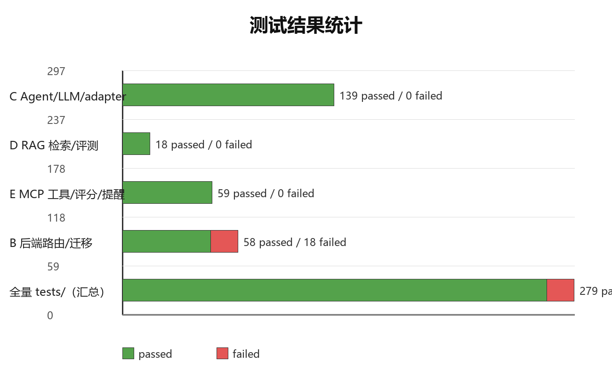

图 5-1 测试结果统计

## 5.4 RAG 检索评测

### 5.4.1 检索命中评测

使用 `rag/evaluate_rag.py` 对四组标准查询进行离线评测，`top_k=5`，结果如下：

| 查询 | 类型 | top_k | 命中数 | 类型正确 | 预期关键词命中 | 最高分 |
|---|---|---|---|---|---|---|
| 想买降噪耳机 | shopping | 5 | 5 | 是 | 是 | 10.2905 |
| 想买学习用品 | shopping | 5 | 5 | 是 | 是 | 3.2369 |
| 参加社团活动 | time | 5 | 5 | 是 | 是 | 6.8045 |
| 参加技术分享 | time | 5 | 5 | 是 | 是 | 10.6279 |

命中标题示例：

- “想买降噪耳机”命中“无线降噪耳机 消费复盘”“索尼 WH-1000XM5 降噪耳机 消费复盘”“降噪台灯 消费复盘”等记录。
- “想买学习用品”命中“学习平板 消费复盘”“护眼学习灯 消费复盘”“降噪台灯 消费复盘”等记录。
- 时间类查询命中“社团例会”“技术分享会”等记录，说明检索组件对时间类数据仍然兼容，但时间主流程本轮不交付。

### 5.4.2 检索指标评测

使用 `rag/evaluate_rag_standard.py` 计算检索侧指标，结果如下：

| 查询 | precision@k | recall@k | MRR | NDCG@k |
|---|---|---|---|---|
| 想买降噪耳机 | 0.40 | 0.3333 | 1.00 | 0.5531 |
| 想买学习用品 | 0.80 | 0.1429 | 1.00 | 0.8539 |
| 参加社团活动 | 0.60 | 0.2500 | 0.50 | 0.5296 |
| 参加技术分享 | 0.40 | 0.2500 | 1.00 | 0.5531 |

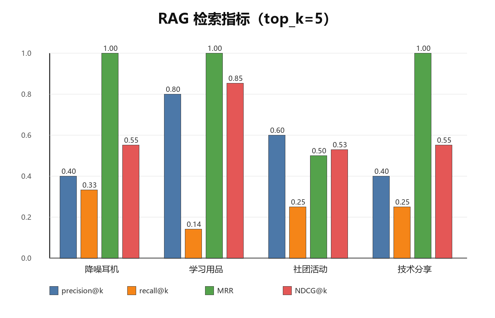

图 5-2 RAG 检索指标

结果分析：

- 四组查询在 top_k=5 内均能命中预期关键词，MRR 多数为 1.00，说明第一条结果通常就是相关记录。
- recall 偏低（0.14~0.33）的主要原因是 top_k=5 相对于相关记录池偏小，部分相关记录没有被返回；后续可以增大 top_k 或引入混合检索。
- 生成侧忠实度和答案相关性指标需要启动后端、RAG 和真实辩论流程才能计算；本轮离线评测未计算，报告中不将其写成已通过结果。

### 5.4.3 RAG 服务与异常场景

RAG 测试覆盖以下场景：

1. 正常命中：检索结果进入正反方和法官上下文，报告引用 RAG 证据。
2. 正常无命中：返回空数组，`rag_search` trace 为 `completed`。
3. 服务断连或返回非法响应：返回空数组，trace 为 `failed`，后续 Agent 继续执行。
4. 用户历史联动：用户复盘写入历史后，下一次按用户检索有机会命中该记录。
5. 防幻觉：没有命中时不生成伪造历史记录。

## 5.5 缺陷与修复

项目开发过程中通过测试和联调发现并修复了若干问题，主要修复记录如下：

| 问题 | 修复内容 | 相关提交/PR |
|---|---|---|
| `/debate` 路由保存提醒时缺少 `Reminder` 导入 | 补充导入，辩论路由测试恢复通过 | PR #89 |
| 接入 C 模块新字段后观察清单权限校验缺失 | 补充 `user_id` 校验和所属用户比较 | `e52537a` |
| 相邻金额被错误拆分或预算关键词吞掉价格 | 限制金额上下文在标点分句内，保留相邻价格 | `5151891` |
| JWT 强制模式导致本地开发兼容性下降 | 恢复 `ENFORCE_JWT` 灵活模式，默认 Token 优先、无 Token 兼容 | `b1de722` |
| `decision_score` 布尔参数解析错误和工具日志重复 | 修正布尔解析，避免成功路径重复记录日志 | `a763bac` |
| 明确价格语句解析错误 | 支持“价格是 2500 元”等显式价格表达 | `75b0213` |
| 多轮字段纠正未使用 `merged_fields` | `/messages` 和 `/cases` 改用 C 模块累计字段 | `541f8c8` |
| 冷静期提醒失败时摘要信息回归 | 恢复 adapter 失败摘要 | `13414fa`、`a87532e` |
| `MISSING_FIELDS` 返回 `data=null` | 修复返回结构，保留追问信息 | `ea565e2` |
| 中文购物解析和商品名裁剪问题 | 修复中文解析规则和商品名边界 | `38f39dd` |
| messages 路由字段合并和 description 复用问题 | 修复字段合并逻辑 | `ef5aeb1` |
| 报告返回占位数据 | 持久化辩论结果，报告读取真实结果 | `303e952` |
| 测试外键占位数据缺失 | 补齐 fixture 外键数据，移除自建真实库 fixture | `5007af9` |
| 数据库迁移机制和 P1 问题 | 完善迁移和测试覆盖 | `55f107a` |

这些问题说明测试和联调在项目中发挥了实际作用，也说明 JWT 接入后仍有部分测试需要同步更新。

## 5.6 项目展示

### 5.6.1 购物决策完整流程

演示步骤：

1. 注册并登录演示用户。
2. 创建案件：“我想买一副 1299 元的降噪耳机，最近学习需要安静，预计每天使用，这次是刚需。”
3. 补充信息：“本月预算还剩 3000 元，已有普通耳机。”
4. 启动分析，查看 RAG 证据、成本分析结果、决策评分、四条庭审事件和判决书。
5. 查看执行轨迹，确认 `input_parser → rag_search → cost_analyzer → decision_score → pro_agent → con_agent → cooling_reminder → judge_agent` 的调用顺序。
6. 提交复盘，查看历史记录和观察清单变化。

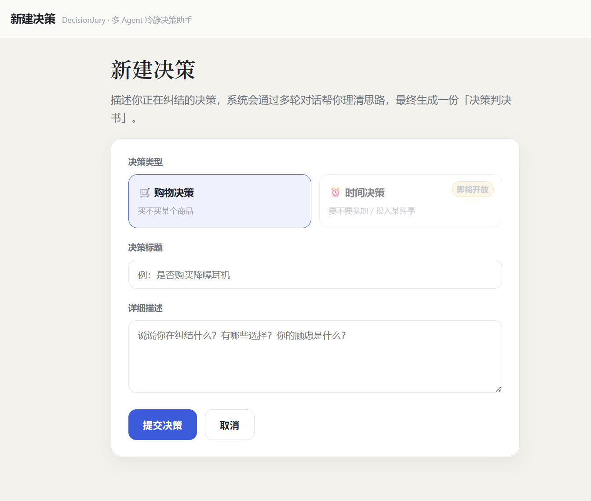

图 5-6 创建购物案件页面

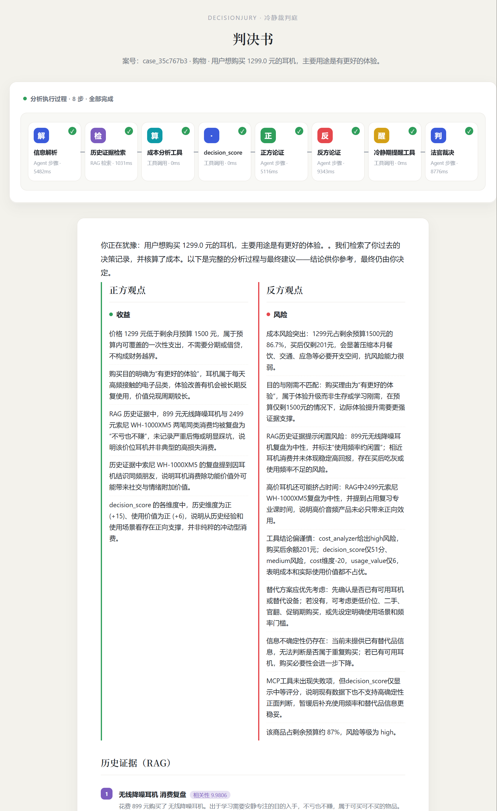

图 5-7 判决书页面（一）：案件摘要、正反方观点与最终裁决

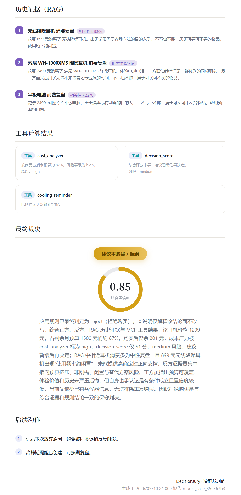

图 5-8 判决书页面（二）：RAG 证据、工具结果与后续动作

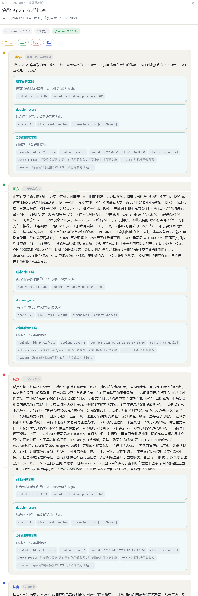

图 5-9 执行轨迹页面

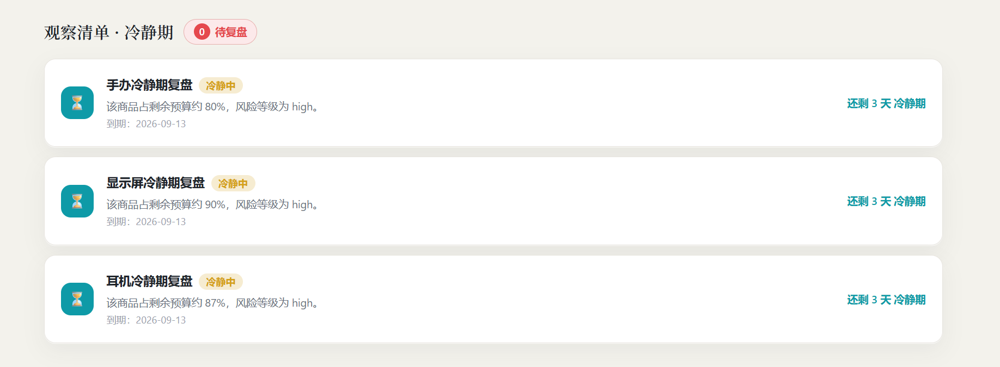

图 5-10 观察清单页面

> 待补截图：多轮对话页（包含“本月预算还剩 3000 元，已有普通耳机”的补充过程）。拍摄方法见 `docs/report/替换实际运行截图指南.md` 第 5 节。

### 5.6.2 多轮价格纠正流程

演示步骤：

1. 创建案件：“想买一部手机，预算 3000 元。”
2. 补充：“价格大概是 2500 元。”
3. 纠正：“刚才价格说错了，不是 2500，是 2200。”
4. 检查系统价格更新为 2200，预算保持 3000，并达到最低字段要求进入分析。

> 待补截图：多轮价格纠正后的字段展示。
> 操作路径：登录后在案件创建页输入“想买一部手机，预算 3000 元”，进入多轮对话页依次发送“价格大概是 2500 元”和“刚才价格说错了，不是 2500，是 2200”，截取价格更新为 2200、预算保持 3000 的页面。

### 5.6.3 工具调用与 RAG 输出

工具调用日志和 RAG 检索结果可以作为答辩证据：

- `cost_analyzer` 返回预算占比、购买后剩余预算和风险等级。
- `decision_score` 返回综合分和四个维度的分值。
- `cooling_reminder` 返回提醒 ID、到期时间和观察项。
- RAG 返回命中标题、内容、得分和标签。

> 待补截图：工具调用日志和 RAG 检索结果。执行轨迹页面已见图 5-9。
> - 工具调用日志：在项目根目录运行 `python -m mcp_tools.demo`，截取 `cost_analyzer`、`decision_score`、`cooling_reminder` 的调用输出；或打开后端 Swagger 调用 `/api/tools/cost-analyzer` 后截图。
> - RAG 检索结果：运行 `python rag/evaluate_rag.py` 截取命中表格；或打开 RAG Swagger `http://127.0.0.1:8001/docs`，调用 `POST /api/rag/search`（`case_type=shopping`、`query=想买降噪耳机`、`top_k=5`）后截图返回结果。

## 5.7 测试结论

1. Agent 编排、LLM 客户端、RAG 检索、工具模块和 adapter 的定向测试全部通过，核心链路具备可运行基础。
2. RAG 四组标准查询在 top_k=5 内全部命中预期关键词，检索类型隔离和标题去重有效。
3. 全量测试为 `292 passed, 5 failed`，失败仅剩 `tests/test_migrate.py` 的引擎隔离问题；JWT 路由断言问题已由最新 `dev` 的测试对齐修复。
4. 本轮未执行真实 DeepSeek API、浏览器完整闭环和 Docker 构建验收，报告中不将 mock 结果写成真实模型结果。
5. 建议在答辩前完成：迁移测试引擎隔离修复、两个购物案例的浏览器全流程截图、真实 DeepSeek 调用记录，并补充 RAG 生成侧指标。

---

# 06 项目总结

> 负责人：全员（各自模块总结后汇总）
> 状态：已完成

---

## 6.1 项目总结与体会

### 6.1.1 项目完成情况

本项目在三周时间内完成了 DecisionJury 购物冷静决策助手的核心功能。系统以 Web 应用形式交付，用户可以通过注册登录进入系统，创建购物决策案件，通过多轮对话补充商品名称、价格和本月剩余预算等字段；达到最低字段要求后，系统依次执行输入解析、RAG 历史检索、成本分析、决策评分、正方 Agent、反方 Agent、条件触发的冷静期提醒和法官 Agent，最终生成包含案件摘要、正反观点、历史证据、工具结果、最终裁决和后续动作的决策报告。前端提供案件创建、多轮对话、庭审回放、判决书、执行轨迹、历史记录和观察清单页面，后端提供完整的 REST API、SQLite 持久化和 JWT 登录鉴权。

项目还完成了 500 条模拟历史样本、基于 jieba + BM25 的检索服务、静态与实时历史合并、RAG 量化评测脚本、三个规则工具、统一工具调用入口、工具调用日志、自动化测试代码以及 Windows、Linux 和 Docker 三种启动部署方式。整体上，项目达到了课程对多 Agent 协作、大语言模型调用、RAG 检索、MCP 工具、多轮状态管理和 Web 演示的基本要求。

需要如实说明的是，本轮范围最终收敛为购物决策，时间决策主流程延期；最新 `dev` 全量测试为 `292 passed, 5 failed`，失败仅剩迁移测试引擎隔离问题；真实 DeepSeek API、浏览器完整闭环和 Docker 构建还需要在答辩前补充验收。这些内容不写成“已经全部完成”，而是作为后续改进项保留。

### 6.1.2 技术收获

| 成员/模块 | 主要收获 |
|---|---|
| A 前端 | 掌握了 React + TypeScript 页面拆分、认证上下文、REST 接口封装、庭审事件渐进展示和多页面状态管理；理解了前后端契约不一致时的排查方法。 |
| B 后端 | 掌握了 FastAPI 路由分层、SQLAlchemy 建模、SQLite 索引和外键、统一响应结构、全局异常处理、JWT 登录鉴权和资源所属用户校验。 |
| C Agent | 掌握了结构化 Prompt 设计、DeepSeek 调用与超时/异常降级、输入字段抽取与多轮合并、规则法官与模型说明分离、trace 记录和 adapter 分层。 |
| D RAG | 掌握了 jieba 分词、BM25 检索、类型隔离、标题去重、静态与实时历史合并、证据契约裁剪以及 P/R/MRR/NDCG 等检索指标评测。 |
| E 工具与工程化 | 掌握了规则工具设计、统一调用入口、参数校验、失败结果封装、调用日志、pytest 测试组织、Windows/Linux/Docker 启动部署和故障排查。 |

### 6.1.3 团队协作体会

项目采用“功能分支 → Pull Request → 组员 review → dev → main”的协作流程。每个成员从 `dev` 创建自己的功能分支，完成一个清晰功能后提交 PR；接口字段变化先更新 `docs/04_API.md`，范围变化同步更新 MVP、SPEC 和里程碑文档。这种方式让前后端、Agent、RAG 和工具模块能够并行开发，也减少了联调时的字段歧义。

实际开发中，团队遇到过接口字段不一致、金额解析歧义、提醒落库失败、测试数据库隔离和 JWT 改造后测试断言失效等问题。解决这些问题时，团队逐步形成了“先复现、再定位、用 trace/日志取证、修复后补测试”的流程。项目也暴露出一些协作上的不足，例如文档更新与代码合并存在时间差、部分测试没有及时跟随接口变化、真实 API 和浏览器闭环验收启动较晚。这些经验对后续项目具有参考价值。

## 6.2 不足与改进

| 不足 | 原因 | 改进方向 |
|---|---|---|
| 时间决策主流程未完成 | 三周时间有限，团队决定优先保证购物主链路 | 后续单独评审时间场景需求，补齐时间案件解析、工具接入和端到端演示 |
| 全量测试仍有 5 个失败 | 迁移测试 fixture 与被测函数 `backend.migrate.engine` 使用不同引擎；`migrate.py` 已补全字段覆盖和迁移后校验，但测试尚未改为同一引擎验证 | 修复迁移测试引擎隔离，补充 JWT 强制/兼容模式和真实迁移场景用例 |
| RAG recall 偏低（0.14~0.33） | top_k=5 相对相关记录池偏小，当前只有 BM25 检索 | 增大 top_k、调整分词和权重，或引入向量检索与混合检索 |
| RAG 生成侧忠实度未完成真实评测 | 需要后端、RAG 和真实模型一起运行 | 在答辩前启动三端服务，用真实 DeepSeek 跑一轮 faithfulness 和 answer_relevancy |
| 真实 DeepSeek API 验收不足 | 本地环境未配置 Key，主要使用本地规则和 mock | 使用受控环境加载授权 Key，分别记录 parser、正反方和法官说明的真实调用结果 |
| 浏览器完整闭环待验收 | 前端页面和接口已实现，但注册→创建→补充→辩论→提醒→复盘的全流程截图尚未补齐 | 按测试计划逐项操作并截图，确认提醒落库、观察清单和复盘联动 |
| 用户鉴权仍不是生产级 | 默认兼容模式允许无 Token 时使用 `user_id` 参数 | 生产环境启用 `ENFORCE_JWT=true`，补齐统一会话、权限和审计 |
| 未使用向量检索和标准 MCP Server | 本轮 MVP 范围控制，BM25 和统一 Python 调用契约已满足课程要求 | 后续可接入向量库和标准 MCP Server 传输，保持 `ToolResult` 契约不变 |
| 前端缺少移动端适配和可访问性优化 | 时间有限，优先保证桌面端演示 | 补充响应式布局、键盘操作和错误提示优化 |

## 6.3 后续计划

1. 答辩前优先修复 B 后端路由与 JWT 行为不一致的测试，修复迁移测试引擎隔离问题，争取全量测试回到稳定通过状态。
2. 在受控环境完成一轮真实 DeepSeek API 验收，分别记录 parser、正方、反方和法官说明的调用结果，区分真实调用和 mock fallback。
3. 按两个购物案例完成浏览器全流程演示和截图，重点验证提醒落库、观察清单查询和复盘写入历史。
4. 补充 RAG 生成侧评测，优化 recall 和忠实度，作为答辩时的量化证据。
5. 如果时间允许，再启动时间决策主流程和向量检索扩展，但不将其作为本轮交付缺陷。

---

# 07 参考文献与附录

> 负责人：组长，全员配合
> 状态：已完成

---

## 7.1 参考文献

参考文献格式参照 GB/T 7714—2015《信息与文献 参考文献著录规则》。正文中引用时使用上标序号，例如 [1]、[2]。

```text
[1] LEWIS P, PEREZ E, PIKTUS A, et al. Retrieval-Augmented Generation for Knowledge-Intensive NLP Tasks[C]//Advances in Neural Information Processing Systems. 2020: 9459-9474.
[2] ROBERTSON S, ZARAGOZA H. The Probabilistic Relevance Framework: BM25 and Beyond[J]. Foundations and Trends in Information Retrieval, 2009, 3(4): 333-389.
[3] YAO S, ZHAO J, YU D, et al. ReAct: Synergizing Reasoning and Acting in Language Models[C]//International Conference on Learning Representations. 2023.
[4] VASWANI A, SHAZEER N, PARMAR N, et al. Attention Is All You Need[C]//Advances in Neural Information Processing Systems. 2017: 5998-6008.
[5] MANNING C D, RAGHAVAN P, SCHÜTZE H. Introduction to Information Retrieval[M]. Cambridge: Cambridge University Press, 2008.
[6] FASTAPI. FastAPI Documentation[EB/OL]. https://fastapi.tiangolo.com/, 2026-09-09.
[7] REACT. React Documentation[EB/OL]. https://react.dev/, 2026-09-09.
[8] DEEPSEEK. DeepSeek API Documentation[EB/OL]. https://api-docs.deepseek.com/, 2026-09-09.
[9] MODEL CONTEXT PROTOCOL. MCP Documentation[EB/OL]. https://modelcontextprotocol.io/, 2026-09-09.
[10] JIEBA. jieba GitHub Repository[EB/OL]. https://github.com/fxsjy/jieba, 2026-09-09.
[11] SQLALCHEMY. SQLAlchemy Documentation[EB/OL]. https://docs.sqlalchemy.org/, 2026-09-09.
[12] 全国信息与文献标准化技术委员会. 信息与文献 参考文献著录规则: GB/T 7714—2015[S]. 北京: 中国标准出版社, 2015.
```

## 7.2 附录 A：接口一览

| 方法 | 路径 | 功能 |
|---|---|---|
| POST | `/auth/register` | 用户注册 |
| POST | `/auth/login` | 用户登录 |
| GET | `/api/health` | 健康检查 |
| POST | `/api/cases` | 创建案件 |
| GET | `/api/cases` | 案件列表 |
| GET | `/api/cases/{case_id}` | 案件详情 |
| PATCH | `/api/cases/{case_id}` | 更新案件 |
| DELETE | `/api/cases/{case_id}` | 删除案件 |
| POST | `/api/cases/{case_id}/messages` | 补充信息 |
| GET | `/api/cases/{case_id}/messages` | 消息列表 |
| POST | `/api/cases/{case_id}/debate` | 启动 Agent 分析 |
| GET | `/api/cases/{case_id}/report` | 查询报告 |
| GET | `/api/cases/{case_id}/trace` | 查询执行轨迹 |
| POST | `/api/cases/{case_id}/feedback` | 提交复盘 |
| GET | `/api/history` | 查询历史 |
| POST | `/api/history` | 新增历史 |
| GET | `/api/watchlist` | 查询观察清单 |
| DELETE | `/api/watchlist/{reminder_id}` | 取消提醒 |
| POST | `/api/rag/search` | RAG 检索 |
| POST | `/api/tools/cost-analyzer` | 成本分析 |
| POST | `/api/tools/cooling-reminder` | 冷静期提醒 |
| POST | `/api/tools/decision-score` | 决策评分 |

## 7.3 附录 B：启动与测试命令

```bash
# Windows 一键启动
start_all.bat

# 手动启动（三个独立终端）
uv run --frozen uvicorn backend.main:app --host 127.0.0.1 --port 8000
uv run --frozen uvicorn retriever:app --app-dir rag --host 127.0.0.1 --port 8001
npm --prefix frontend run dev

# Linux screen 部署
bash deploy/install.sh
bash deploy/start.sh
bash deploy/stop.sh

# 测试
uv run --frozen pytest -p no:cacheprovider tests -q --tb=line --show-capture=no
```

## 7.4 附录 C：演示案例

| 案例 | 用户输入 | 关键字段 | 实际/预期结果 |
|---|---|---|---|
| 购物-降噪耳机 | 我想买一副 1299 元的降噪耳机，最近学习需要安静，预计每天使用，这次是刚需 | 价格 1299、剩余预算 3000、已有普通耳机 | 成本占比约 0.43、风险 medium；法官规则建议 `delay`；RAG 命中历史证据；工具结果进入报告 |
| 购物-价格纠正 | 想买一部手机，预算 3000 元；价格大概是 2500 元；刚才价格说错了，不是 2500，是 2200 | 价格 2200、预算 3000 | 价格更新为 2200，预算保持 3000，达到最低字段要求 |
| 时间-社团活动 | 是否参加占用周末两天的社团活动 | 时间组件兼容样例 | 时间主流程本轮未交付；RAG 时间类检索可命中相关记录 |

## 7.5 附录 D：团队成员分工

| 成员 | 模块 | 主要贡献 | 对应报告章节 |
|---|---|---|---|
| A | 前端交互 | React 页面、认证壳、案件/对话/庭审/报告/历史/观察清单展示、API 封装 | 2、3.4、4.2、5.3 |
| B | 后端 API 与状态 | FastAPI 路由、SQLite 模型、案件与消息状态、报告/trace/历史/提醒持久化、JWT 鉴权 | 3.1、4.1、4.2、5.2 |
| C | Agent 与 LLM | 输入解析、正反方、法官、DeepSeek 调用与降级、RAG/MCP adapter、结构化结果 | 1、3.3、4.2、5.3 |
| D | RAG 与数据检索 | 500 条历史样本、BM25 检索服务、静态与实时历史合并、证据契约、RAG 评测 | 3.1、3.3、4.2、5.3 |
| E | 工具与工程化 | 成本分析、决策评分、冷静期提醒、统一调用入口、日志、测试、启动与部署 | 3.3、4.2、5 |

## 7.6 附录 E：测试结果摘要

| 测试分组 | 实际结果 |
|---|---|
| C Agent/LLM/RAG-MCP adapter | 139 passed |
| D RAG 检索、数据加载、评测指标 | 18 passed |
| E MCP 工具、评分、提醒、工具路由 | 59 passed |
| B 后端路由、消息、辩论、历史、观察清单、轨迹、迁移 | 71 passed, 5 failed |
| 全量 `tests/`（A-E 汇总） | 292 passed, 5 failed, 7 warnings |

已知失败项仅剩 `tests/test_migrate.py` 的引擎隔离问题，具体分析见第 5 章第 5.3 节。RAG 四组标准查询在 top_k=5 内均命中预期关键词，检索指标见第 5 章第 5.4 节。

---
